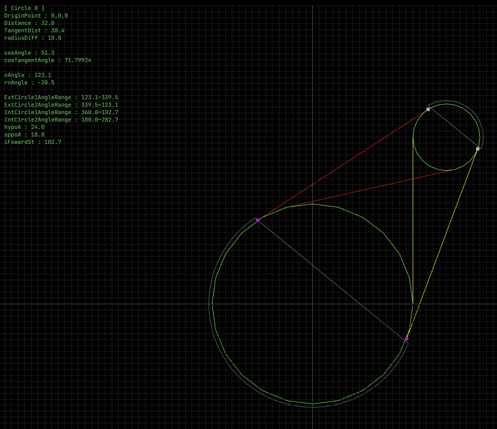
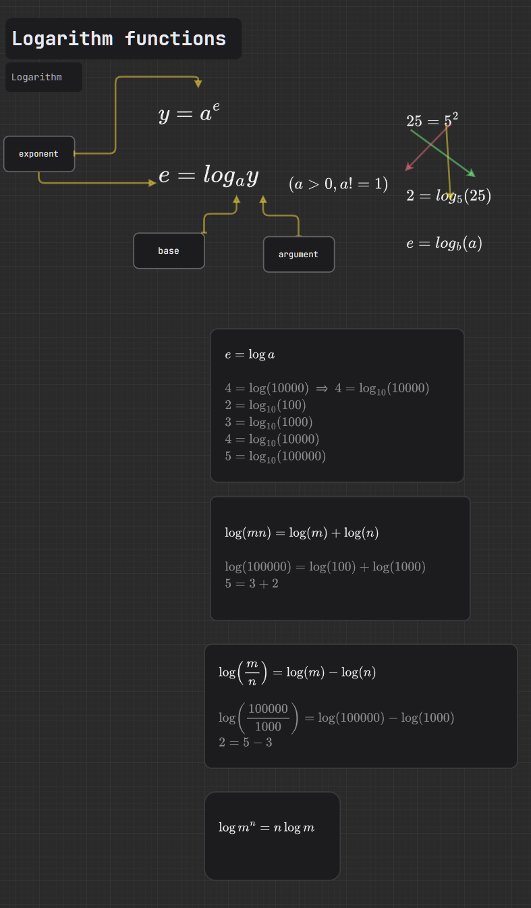

# Mathematics
数学を学ぶ理由と便利に使っているところをアプリでご紹介しようと思います

#### 目標の一つ目はActive Maths
* 次の公式の誘導、発生と発見の過程を**自分で作る**ことができるようにします。
* ある問題に対して学ばなくても、自分で公式を作って解決することができます。

#### 目標の二つ目は応用の拡大

#### 目標の三つ目は互換性
* 理解できたら、どのようなプログラミング言語でも、どのような状況でも活用できます。

# Mathematics History

# Maths Model
数学は自然の原理などを文字と数字で公式として構成しました。X=4、Y=3のArea of Rectangleに関して
Xが変化したら、Areaは変化されます。
## 唯一な値と互換性の利用
  3*4=12などの掛け算したら、結果の値が唯一な状態になるます。

## お互いの約束した文字の表記

## 1:1関数関係の変化量
* f(x) = 2x
* f(x) = 1/2x
* f(x) = x^2
## 1:X関数関係の変化量

## X:X関数関係の変化量、Irregular
* データ配列での詳細化
* 3 = 2, 4 = 6, 7 = 2\

# Math Skill Tree

#### 参考にするサイト
https://www.mathsisfun.com/

* 中等学校の数学
* 高等学校の数学
* 大学での数学

### Visualize and Programming
#### WEB-GL

* WebGL
* https://experiments.withgoogle.com/search?q=fluid
https://registry.khronos.org/webgl/specs/latest/2.0/
https://github.com/mdn/dom-examples
https://webglfundamentals.org/
https://webgl2fundamentals.org/
https://threejs.org
https://github.com/mikolalysenko/femgl
https://github.com/alzwded/webgl-render-fea-hex
https://experiments.withgoogle.com/search?q=WebGL

#### Practice

* [Geometry](importmap/mathisfun/curr/Geometry.md)

# Life and Math
こちらは数学の勉強をする理由と
数学を勉強したら、
どこに活用できるのかを見ながら、

将来、生活を便利に送るために活用できる方法をご紹介します。

## Society and Math

## Science Mathematics
数学は全ての分野で隠して使用されているので、
将来には最も重要な事になります。

## Business Mathematics
お金を稼ぐために数学で計算しなければならない\
1年後にはいくらくらいになると思いますか?\
投資したいので...
### 会計
### 金融
### Statistics
### Stock
### 為替レート

### Program Preview

### TODO Implement Others

	
