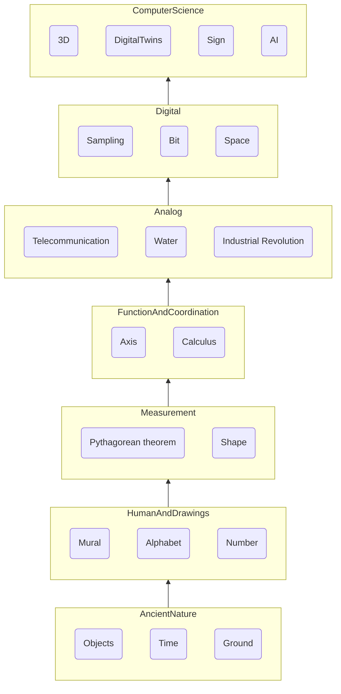

数学を学ぶ理由と便利に使っているところをアプリでご紹介しようと思います。

こちらは数学の勉強をする理由と
数学を勉強したら、
どこに活用できるのかを見ながら、

将来、生活を便利に送るために活用できる方法をご紹介します。

中等学校の数学

高等学校の数学

大学での数学\

数学は全ての分野で隠して使用されているので、
将来には最も重要な事になります。

お金を稼ぐために数学で計算しなければならない\
1年後にはいくらくらいになると思いますか?\
投資したいので...

### Mathematics History 

### Program Preview

### TODO Implement Others

