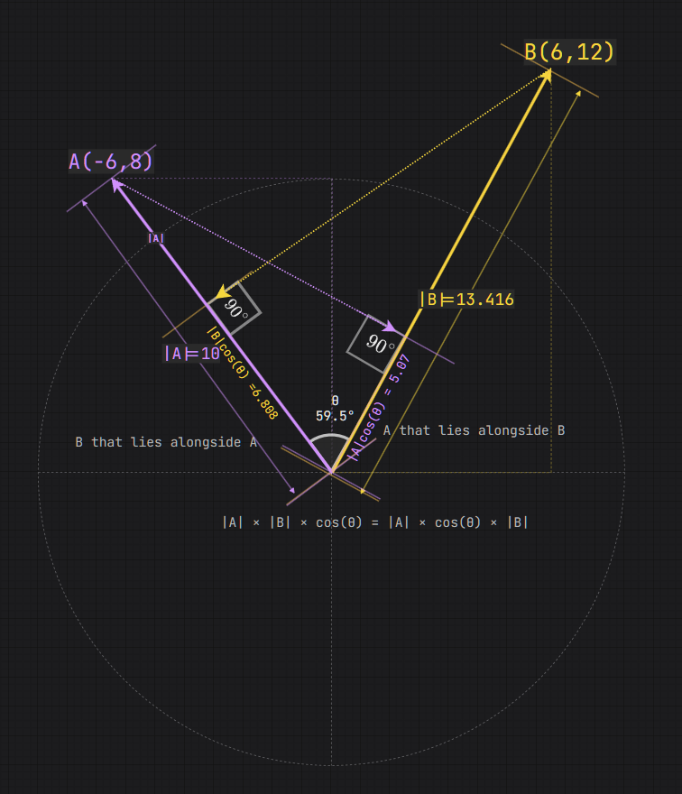
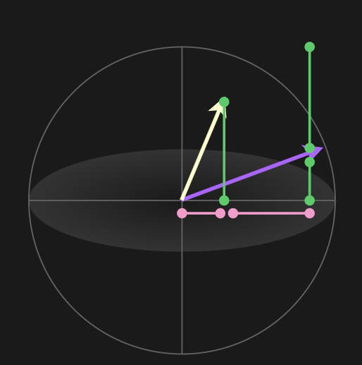
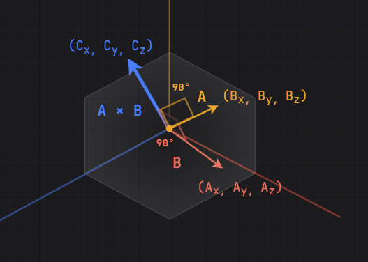

# Geometry
## Triangle


## Angle = Radian|Degree
45/360 = x/6rad

6rad = 2PI
3rad = 1PI
rad = 57....deg


## Scalar => Return Type : Number
### 2D Scalar
* scalar = sqrt(pow(x, 2)+pow(y, 2))
* x=3, y=4, s=5..
* scalar = radius

### 3D Scala
* sqrt(pow(x, 2)+pow(y, 2)+pow(z, 2))
* 3 4 5 => 7..


## Vector => Return Type : Axis(x, y, z)
(x, y)/sqrt(pow(x)+pow(y))
(x, y, z)/sqrt(pow(x)+pow(y)+pow(z))
* 3 4 => (x/5, y/5) = (cos(theta), sin(theta)) = Normalized Vector
* 3 4 5 => (x/7.., y/7.., z/7..) = Normalized Vector
* Normalized Vector * Scalar = Position = (x, y, z)

## ArcCosine => InputType = Cos(θ)|Rate, Return Type : Radian
## Cosine => InputType = Radian, Return Type : Rate|Cos(θ)

## Dot Product => Return Type : Number



### Formula1
* A · B = |A| × |B| × cos(θ)
* |A| is the magnitude (length, scalar, radius) of vector A
* |B| is the magnitude (length, scalar, radius) of vector B
### Formula2
*  A · B = (Ax × Bx) + (Ay × By)
#### Derived

```text
1. Pythagorean theory
c^2 = a^2 + b^2

2. A, Bの二つの座標はどこにあっても(0, 0, 0)で基準化することが可能です。
3. ドット積は新しい絶対値としての役割

Ax * Bx => a^2　
Ay * By => b^2

```

### Examples 2D
```text
A(-6, 8), B(5, 12)

Formula1 A · B = (Ax × Bx) + (Ay × By)
A · B = -6 × 5 + 8 × 12
A · B = -30 + 96
A · B = 66


Formula2 A · B = |A| × |B| × cos(θ)
A · B = 10 × 13.416 × cos(59.5°)
A · B = 10 × 13.416 × 0.5075...
A · B = 65.98... = 66 (rounded)


```

### Examples 3D
```text
A(4, 8, 10), B(9, 2, 7)

Formula1 A · B = (Ax × Bx) + (Ay × By) + (Az × Bz)
A · B = (9 × 4) + (2 × 8) + (7 × 10)
A · B = 36 + 16 + 70
A · B = 122


Formula2 A · B = |A| × |B| × cos(θ)
122 = √180 × √134 × cos(θ)
cos(θ) = 122 / (√180 × √134)
cos(θ) = 0.7855...
θ = cos-1(0.7855...) = 38.2...°

Math.acos(0.7)

```

## Cross Product = ReturnType : Axis(3, 4, 5)


### Expression
* X = Cross Product
* × = Multiplication, 3 × 4 = 12
* N = normalized vector
* A X B = Cross Product

### Formula1 
* A X B = |A| × |B| × sin(θ) × N
* sin(θ) = (A X B) / (|A| × |B| × N)
* N = (A X B) / (|A| × |B| × sin(θ))

Dot Productで演算したcos(θ)を利用して\
cos-1(cos(θ)) => sin(radian)

### Formula2
* A×B = (Cx, Cy, Cz)
* Cx = Ay*Bz − Az*By
* Cy = Az*Bx − Ax*Bz
* Cz = Ax*By − Ay*Bx

### Examples


# Inside Function Codes
[function Sin(parameter)](../code_signfunction.md)


## Inverse Sine Function


## Dot Product


