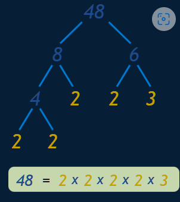
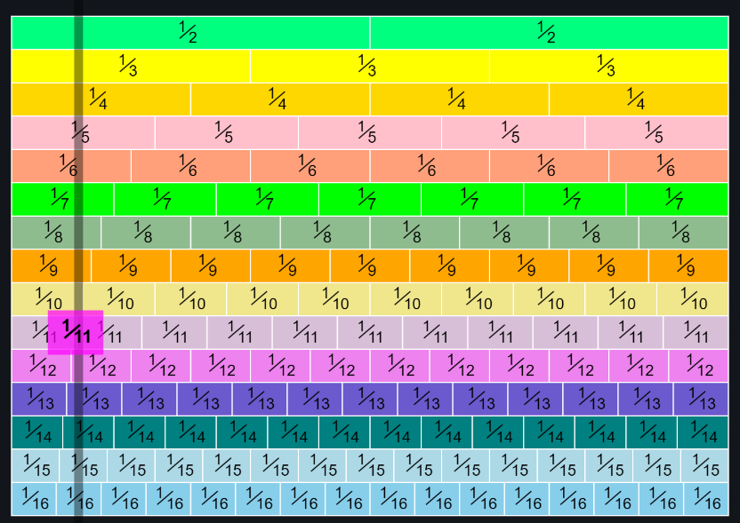

# Numbers

## Characters
* Characters=[A-Za-z] \
* Symbols=[[Symbols](Symbols.md)]
* SI Prefix=[[Prefix](SIPrefix.md)]
* Measurements=[]
* one thousand million billion trillion quadrillion quintillion


## Brackets
Brackets (Parentheses)
Brackets are symbols used in pairs to group things together.


brackets
Types of brackets include:

parentheses or "round brackets" ( )
"square brackets" or "box brackets" [ ]
braces or "curly brackets" { }
"angle brackets" < >
(Note: Angle brackets can be confusing as they
look like the "less than" and "greater than" signs)

When we see things inside brackets we do them first (as explained in Order of Operations).

Example: (3 + 2) × (6 − 4)
The parentheses group 3 and 2 together, and 6 and 4 together, so they get done first:

(3 + 2) × (6 − 4)
= (5) × (2)
= 5×2
= 10
Without the parentheses the multiplication is done first:

3 + 2 × 6 − 4
= 3 + 12 − 4
= 11 (not 10)

With more complicated grouping we can use different types of brackets:

Example: [(3 + 2) × (6 − 4) + 2] × 4
The parentheses group 3 and 2 together, and 6 and 4 together, and the square brackets tell us to do all the calculations inside them before multiplying by 4:

[(3 + 2) × (6 − 4) + 2] × 4
= [(5) × (2) + 2] × 4
= [10 + 2] × 4
= 12 × 4
= 48
Curly Brackets
Curly brackets {} are used in Sets:

Example: {2, 4, 6, 8}
Is the set of even numbers from 2 to 8

Angle Brackets
Angle brackets 〈 〉 are used in Bra-Ket Notation.


## Numbers
* Numbers=[0-9]+
* Digit=[16,10,8,2]+
* 16 Digit=[0-9A-Fa-f]+

* 16 = Hexadecimal
* 8 = Octa
* 10 = Decimal
* 2 = Bit
* .0 = Precision


### Place Value

Millions	Hundred-Thousands Ten-Thousands Thousands Hundreds Tens Ones

```
In the number 327:
"Three Hundred Twenty Seven"
the "7" is in the Ones position, meaning 7 ones (which is 7),
the "2" is in the Tens position meaning 2 tens (which is twenty),
and the "3" is in the Hundreds position, meaning 3 hundreds.

As we move left, each position is 10 times bigger!
Tens are 10 times bigger than Ones
Hundreds are 10 times bigger than Tens

As we move right, each position is 10 times smaller.
From Hundreds, to Tens, to Ones	 

But what if we continue past Ones?
What is 10 times smaller than Ones?

1/10ths (Tenths) are!

327.4
But we must first put a decimal point,
so we know exactly where the Ones position is:	 	
"three hundred twenty seven and four tenths"
but we usually just say "three hundred twenty seven point four"
And that is a Decimal Number!


What is 2.3 ?
On the left side is "2", that is the whole number part.
The 3 is in the "tenths" position, meaning "3 tenths", or 3/10
So, 2.3 is "2 and 3 tenths"

On the left side is "13", that is the whole number part.
There are two digits on the right side, the 7 is in the "tenths" position, and the 6 is the "hundredths" position
So, 13.76 is "13 and 7 tenths and 6 hundredths"


...as a Decimal Fraction
Or we can think of a decimal number as a Decimal Fraction.

A Decimal Fraction is a fraction where the denominator (the bottom number) is a number such as 10, 100, 1000, etc (in other words a power of ten)

So "2.3" looks like:	 
23/10
 	 
And "13.76" looks like:	 
1376/100
 

... as a Whole Number and Decimal Fraction
Or we can think of a decimal number as a Whole Number plus a Decimal Fraction.

So "2.3" looks like:
2 and 3/10
 	 
And "13.76" looks like:	
13 and 76/100
Those are all good ways to think of decimal numbers.


A zero is really saying "there is no value at this decimal place".

In a number like 10, the zero is saying "no ones"
In a number like 2.50 the zero is saying "no hundredths"

```
### Decimals
A Decimal Number (based on the number 10) contains a Decimal Point.
```

Here is the number "forty-five and six-tenths" written as a decimal number:
The decimal point goes between Ones and Tenths.
45.6 has 4 Tens, 5 Ones and 6 Tenths, like this:

The word "Decimal" really means "based on 10" (From Latin decima: a tenth part).

We sometimes say "decimal" when we mean anything to do with our numbering system, but a "Decimal Number" usually means there is a Decimal Point.


```
#### Definition of Decimal
The word "Decimal" really means "based on 10" (From Latin decima: a tenth part).

We sometimes say "decimal" when we mean anything to do with our numbering system, but a "Decimal Number" usually means there is a Decimal Point.


#### Large and Small

17.597 . is Decimal Point
1 Ones 7 Tens 1/10 tenths 1/100 hundredths 1/1000 thousands

10x times bigger
10x times smaller

to show values greater than one or less than one.

#### Ways to think about Decimal Numbers ...
* ... as a Whole Number Plus Tenths, Hundredths, etc
```
We can think of a decimal number as a whole number plus tenths, hundredths, etc:


Example 1: What is 2.3 ?
On the left side is "2", that is the whole number part.
The 3 is in the "tenths" position, meaning "3 tenths", or 3/10
So, 2.3 is "2 and 3 tenths"
Example 2: What is 13.76 ?
On the left side is "13", that is the whole number part.
There are two digits on the right side, the 7 is in the "tenths" position, and the 6 is the "hundredths" position
So, 13.76 is "13 and 7 tenths and 6 hundredths"
```
* ... as a Decimal Fraction
```
Or we can think of a decimal number as a Decimal Fraction.

A Decimal Fraction is a fraction where the denominator (the bottom number) is a number such as 10, 100, 1000, etc (in other words a power of ten)

So "2.3" looks like:	 
23
10
 	 
And "13.76" looks like:	 
1376
100
 
```

* ... as a Whole Number and Decimal Fraction
```
Or we can think of a decimal number as a Whole Number plus a Decimal Fraction.

So "2.3" looks like:	2 and  
3
10
 	 
And "13.76" looks like:	13 and  
76
100
Those are all good ways to think of decimal numbers.
```

#### Convert Fractions to Decimals
```text
The simplest method is to use a calculator
Just divide the top of the fraction by the bottom, and read off the answer!

Example: What is  
5
8
 as a decimal ... ?
calculator
... get your calculator and type in "5 / 8 ="

The answer should be 0.625

No Calculator? Use Long Division to Decimal Places
Example: here is what long division of  
5
8
 looks like:

    0.625
 8 )5.000
    0
    5.0
    4.8
      20
      16
       40
       40
        0
In that case we inserted extra zeros and did  
5.000
8
 to get 0.625

Read the Long Division to Decimal Places page for more details.

Another Method
Yet another method you may like is to follow these steps:
Step 1: Find a number you can multiply by the bottom of the fraction to make it 10, or 100, or 1000, or any 1 followed by 0s.
Step 2: Multiply both top and bottom by that number.
Step 3. Then write down just the top number, putting the decimal point in the correct spot (one space from the right hand side for every zero in the bottom number)
Example: Convert  
3
4
 to a Decimal
Step 1: We can multiply 4 by 25 to become 100

Step 2: Multiply top and bottom by 25:

×25
right over arrow
3
4
 = 	 
75
100
right under arrow
×25
Step 3: Write down 75 with the decimal point 2 spaces from the right (because 100 has 2 zeros);

Answer = 0.75

Example: Convert  
3
16
 to a Decimal
Step 1: We have to multiply 16 by 625 to become 10,000

Step 2: Multiply top and bottom by 625:

×625
right over arrow
3
16
 = 	 
1,875
10,000
right under arrow
×625
Step 3: Write down 1875 with the decimal point 4 spaces from the right (because 10,000 has 4 zeros);

Answer = 0.1875

Example: Convert  
1
3
 to a Decimal
Step 1: There is no way to multiply 3 to become 10 or 100 or any "1 followed by 0s", but we can calculate an approximate decimal by choosing to multiply by, say, 333

Step 2: Multiply top and bottom by 333:

×333
right over arrow
1
3
 = 	 
333
999
right under arrow
×333
Step 3: Now, 999 is nearly 1,000, so let us write down 333 with the decimal point 3 spaces from the right (because 1,000 has 3 zeros):

Answer = 0.333 (accurate to only 3 decimal places!)


```


#### Recurring Decimal
Recurring Decimal
A decimal number with a digit (or group of digits) that repeats forever.

Often show by "..."

Examples:

1/3 = 0.333... (the 3 repeats forever)
1/7 = 0.142857142857... ( the "142857" repeats forever)
77/600 = 0.128333... (the 3 repeats forever)

The part that repeats can also be shown by placing dots over the first and last digits of the repeating pattern, or by a line over the pattern.

Also called a "Repeating Decimal".


#### Terminating Decimal
A decimal number that has digits that end.

Examples:

0.25 (it has two decimal digits)
    ↑ terminates(ends)
3.0375 (it has four decimal digits)

In contrast a Recurring Decimal has digits that go on forever
Example: 1/3 = 0.333... (the 3 repeats forever) is a Recurring Decimal, not a Terminating Decimal


#### Dividing Decimals
```
How do we divide when there are decimal points involved?

Well, it is easier to divide by a whole number ... so multiply by 10 until it is!

But we must do the same thing to both numbers in the division.
Example: 15 divided by 0.2
When we multiply the 0.2 by 10 we get a whole number:

0.2 × 10 = 2

But we must also do it to the 15:

15 × 10 = 150

So 15 ÷ 0.2 has become 150 ÷ 2 (both numbers are 10 times larger):

150 ÷ 2 = 75

And so the answer is:

15 ÷ 0.2 = 75

dividend / divisor
The number we divide by is called the divisor.


To divide decimal numbers:

Multiply the divisor by as many 10's as we need, until it is a whole number.
Remember to multiply the dividend by the same number of 10's.


Multiplying by 10 is easy, we just shift one space over like this:

Example: Divide 6.4 by 0.4
Let us move one space for both:

move 1
6.4	→	64
0.4	→	4
move 1
6.4
0.4
is exactly the same as  
64
4

as we did the move for both numbers.

Now we can calculate:

64
4
= 16

So the answer is:

6.4
0.4
= 16


Are there really 16 lots of 0.4 in 6.4? Let's see:

For harder questions we may need to use Long Division:

Example: Divide 0.539 by 0.11
First we need to make the move twice to make 0.11 into a whole number:

move 2 spaces
0.539	→	5.39	→	53.9
0.11	→	1.1	→	11
move 2 spaces
0.539
0.11
  is exactly the same as  
53.9
11
 

But what about 53.9? It still has a decimal point.

Well, we can ignore the decimal point in the dividend so long as we remember to put it back later.

First we do the calculation without the decimal point:

   049
11)539
   0
   53
   44
    99
    99
     0
Now put the decimal point in the answer directly above the decimal point in the dividend:

   04.9
11)53.9

The answer is 4.9

Another example:

Example: Divide 9.1 by 7
The divisor (7) is already a whole number, so no need for any moves.

Now, ignore the decimal point in the dividend and use Long Division:

  13
7)91
  7
  21
  21
   0

Put the decimal point in the answer directly above the decimal point in the dividend:

  1.3
7)9.1
The answer is 1.3


Does 0.999... = 1 ?
The idea is that 0.9 recurring
(0.999... with the digits going on forever)
is actually equal to 1

Is this really true?
You decide! But here we give some nice arguments as to why it does.

Three Thirds
Start with:	 
1
3
  = 0.333...
Times 3:	 
3
3
  = 3 × 0.333...
So:	1 = 0.999...
Using Algebra
Let us start by having x = 0.999...

x = 0.999...

10x = 9.999...

Subtract x from each side to give us:

9x = 9.999... − x

but we know that x is 0.999..., so:

9x = 9.999... − 0.999...

9x = 9

Divide both sides by 9:

x = 1

But hang on a moment I thought we said x was equal to 0.999... ?

Yes, it does, but from our calculations x is also equal to 1, so:

x = 0.999... = 1

And so:

0.999... = 1

How Many Nines?
If 0.999... and 1 are the same number, then their difference will be zero.

1 nine:	1 − 0.9 = 0.1
2 nines:	1 − 0.99 = 0.01
3 nines:	1 − 0.999 = 0.001
0.001 =  
1
103
 :	1 − 0.999 =  
1
103
 
n nines:	1 − 0.(n 9s) =  
1
10n
 
As n goes to infinity  
1
10n
  goes to zero.

So the difference between 1 and 0.999... is zero

0.999... = 1

Infinite Geometric Series
We can think of 0.999... as being equal to:

=	0.9 + 0.09 + 0.009 + 0.0009 + ...
=	0.9×0.10 + 0.9×0.11 + 0.9×0.12 + ...
This is an Infinite Geometric Series where a = 0.9 and r = 0.1 with the series being convergent because r is between −1 and +1. The formula for the sum is:

a
1 − r
 

So our sum is equal to:

0.9
1 − 0.1
  =  
0.9
0.9
  = 1

0.999... = 1

 

Footnote: we use 0.999... as notation for 0.9 recurring, some people put a line, or little dot, above the 9 like this: 0.9


Subtracting Decimals
Subtracting decimals is easy when you keep your work neat

To subtract decimals, follow these steps:

Write down the two numbers, one under the other, with the decimal points lined up.
Add zeros so the numbers have the same length
Then subtract normally, remembering to put the decimal point in the answer
Example: Subtract 0.03 from 1.1
Line the decimals up:	 	 	1.1
 	 	−	0.03 
 	 	 	 
"Pad" with zeros:	 	 	1.10
 	 	−	0.03
 	 	 	 
Subtract:	 	 	1.10
 	 	−	0.03
 	 	 	1.07
Answer: 1.07

That was just like 110 − 3 = 107, but with the decimal point in a different position

 

Example: Calculate 7.005-0.55
Line the decimals up:	 	 	7.005
 	 	−	0.55
 	 	 	 
"Pad" with zeros:	 	 	7.005
 	 	−	0.550
 	 	 	 
Subtract:	 	 	7.005
 	 	−	0.550
 	 	 	6.455
Answer: 6.455

And that was just like 7005 − 550 = 6455
```


### Round, Floor, Ceil, Cut

### Absolute Value
### Composing and Decomposing Numbers
#### Composing
```
So 3 hundreds, 4 tens and 9 ones make 349, in other words:

300 + 40 + 9  ⇒  349
"Composing"

Example: Compose 2 hundreds, 7 tens and 9 ones.
200 + 70 + 9 = 279
```
#### Decomposing
```
Decomposing is when we break the number apart:

349  ⇒  300 + 40 + 9
"Decomposing"

Example: Decompose 3,456
3,456 = 3,000 + 400 + 50 + 6
```
#### Standard and Expanded Form
```
Some people call the two different forms "Standard" and "Expanded":

349	300 + 40 + 9
Standard Form	Expanded Form

Example: Put 925 into Expanded Form
925 = 900 + 20 + 5
```
#### Decimal Numbers
```
We can also compose and decompose decimal numbers:

4 + 0.7 + 0.08  ⇒  4.78
"Composing"


37.2  ⇒  30 + 7 + 0.2
"Decomposing"


Example: Decompose 1.35
1.35 = 1 + 0.3 + 0.05
```

### Composite and Prime Number
* When a number can be divided up exactly it is a Composite Number
* When a number cannot be divided up exactly it is a Prime Number

```
Prime : 2 3 5 7
Composite : 4 6 8 9 
       => 2*2 2*3 2*2*2 3*3
whole number that can be made by multiplying other whole numbers.

Example: 6 can be made by 2 × 3 so is a composite number.

But 7 can not be made by multiplying other whole numbers 
(1×7 would work, but we said to use other whole numbers) so 
7 is not a composite number, it is a prime number.

All whole numbers above 1 are either composite or prime.

And that is why they are called "Composite" Numbers because composite means "something made by combining things"
```

#### Not 1
Years ago 1 was included as a Prime, but now it is not:

1 is not Prime and also not Composite.
#### Dividing Into Equal Groups
It is all about trying to divide the number into equal groups
Some whole numbers can be divided up exactly, and some can't!
6 can be divided exactly by 2, or by 3: 6 = 2 × 3
But 7 cannot be divided up exactly:
And we give them names:


#### Not Into Fractions
We are only dealing with whole numbers here! We are not going to cut things into halves or quarters.
Not Into Groups of 1
OK, we could have divided 7 into seven 1s (or one 7) like this:

prime 1x7
7 = 1 x 7
But we could do that for any whole number!


#### Prime Factorization
* "Prime Factorization" is finding which prime numbers multiply together to make the original number.
```
Example: What are the prime factors of 12 ?
It is best to start working from the smallest prime number, which is 2, so let's check:

12 ÷ 2 = 6

Yes, it divided exactly by 2. We have taken the first step!

But 6 is not a prime number, so we need to go further. Let's try 2 again:

6 ÷ 2 = 3

Yes, that worked also. And 3 is a prime number, so we have the answer:

12 = 2 × 2 × 3

As you can see, every factor is a prime number, so the answer is right.

```
It is neater to show repeated numbers using exponents:
* Without exponents: 2 × 2 × 3
* With exponents: 2^2 × 3

* Example: What is the prime factorization of 147 ?
```
Can we divide 147 exactly by 2?

147 ÷ 2 = 73½

No we can't. The answer should be a whole number, and 73½ is not.

Let's try the next prime number, 3:

147 ÷ 3 = 49

That worked, now try factoring 49.

The next prime, 5, does not work. But 7 does, so we get:

49 ÷ 7 = 7

And that is as far as we need to go, because all the factors are prime numbers.

147 = 3 × 7 × 7
= 3 × 7^2

Example: What is the prime factorization of 17 ?
Hang on ... 17 is a Prime Number.

So that is as far as we can go.

17 = 17
```

##### Another Method
We just did factorization by starting at the smallest prime and working upwards.

But sometimes it is easier to break a number down into any factors we can ... then work those factor down to primes.

Example: What are the prime factors of 90 ?
Break 90 into 9 × 10

The prime factors of 9 are 3 and 3
The prime factors of 10 are 2 and 5
So the prime factors of 90 are 3, 3, 2 and 5

90 = 2 × 3^2 × 5


##### Factor Tree

```
A "Factor Tree" can help: find any factors of the number, then the factors of those numbers, etc, until we can't factor any more.

Example: 48
factor tree 48 = 2 x 2 x 2 x 2 x 3
48 = 8 × 6, so we write down "8" and "6" below 48

Now we continue and factor 8 into 4 × 2

Then 4 into 2 × 2

And lastly 6 into 3 × 2

We can't factor any more, so we have found the prime factors.

Which reveals that 48 = 2 × 2 × 2 × 2 × 3

48 = 2^4 × 3


```

##### Unique
```text

And here is another thing:

There is only one (unique!) set of prime factors for any number.

Example: the prime factors of 330 are 2, 3, 5 and 11
330 = 2 × 3 × 5 × 11

There is no other possible set of prime numbers that can be multiplied to make 330.
```

### Whole Numbers and Integers
Whole Numbers { 0, 1, 2, 3, 4, ... } 0, 27,398, 2345
(But numbers like ½, 1.1 and −5 are not whole numbers.)

Counting Numbers { 1, 2, 3, 4, ... } 1, 18, 27, 2061
Counting Numbers are Whole Numbers, but without the zero. Because you can't "count" zero.

Integers { ... −4, −3, −2, −1, 0, 1, 2, 3, 4, ... } −15, 0, 27, 1102
Integers are like whole numbers, but they also include negative numbers ... but still no fractions allowed!
Integers = { ..., −4, −3, −2, −1, 0, 1, 2, 3, 4, ... }
Negative Integers = { ..., −4, −3, −2, −1 }
Positive Integers = { 1, 2, 3, 4, ... }
Non-Negative Integers = { 0, 1, 2, 3, 4, ... } (includes zero, see?)


### Even Number, Odd Number


### Rational Number and Irrational
```
A number that can be made as a fraction of two integers (an integer itself has no fractional part).

In other words a/b is a rational number when a and b are numbers like -2 or 7 or 123. But be careful: b cannot be zero.

Examples:
• 1/2 is a rational number
• 0.75 is a rational number (3/4)
• 1 is a rational number (1/1)
• 2 is a rational number (2/1)
• 2.12 is a rational number (212/100)
• −6.6 is a rational number (−66/10)

There are numbers that cannot be written like that, such as π (pi), which is an "Irrational Number".

The word comes from "ratio" (not because they are rational thinkers or anything).

1.5 = 3/2 = Ratio - Rational
PI = 3.14159 = ?/? = No Ratio = Irrational
```

### Rational Number
```
A Rational Number can be made by dividing an integer by an integer.
(An integer itself has no fractional part.)

Example:
1.5 is a rational number because 1.5 = 3/2   (3 and 2 are both integers)

Rational Number

Most numbers we use in everyday life are Rational Numbers.

You can make a few rational numbers yourself using the sliders below:


Here are some more examples:

Number	As a Fraction	Rational?
5	5/1	Yes
1.75	7/4	Yes
1000	1000/1	Yes
.001	1/1000	Yes
−0.1	−1/10	Yes
0.111...	1/9	Yes
√2
(square root of 2)	?	NO !
Oops! The square root of 2 cannot be written as a simple fraction! And there are many more such numbers, and because they are not rational they are called Irrational.

Another famous irrational number is Pi (π):

Rational Number

Formal Definition of Rational Number
More formally we say:

A rational number is a number that can be in the form p/q
where p and q are integers and q is not equal to zero.

So, a rational number can be:

p
q

where q is not zero.

Examples:
p	q	p / q	=
1	1	1/1	1
1	2	1/2	0.5
55	100	55/100	0.55
1	1000	1/1000	0.001
253	10	253/10	25.3
7	0	7/0	No! "q" can't be zero!
Just remember: q can't be zero.

Using Rational Numbers
add, subtract, multiply and divide
If a rational number is still in the form "p/q" it can be a little difficult to use, so I have a special page on how to:

Add, Subtract, Multiply and Divide Rational Numbers


Fun Facts ....
The ancient greek mathematician Pythagoras believed that all numbers were rational, but one of his students Hippasus proved (using geometry, it is thought) that you could not write the square root of 2 as a fraction, and so it was irrational.

But followers of Pythagoras could not accept the existence of irrational numbers, and it is said that Hippasus was drowned at sea as a punishment from the gods!
```

#### Using Rational Numbers
```
Using Rational Numbers
How to add, subtract, multiply and divide rational numbers

A rational number is a number that can be written as a simple fraction (i.e. as a ratio).

Examples:

Number	As a Fraction
5	5/1
1.75	7/4
.001	1/1000
0.111...	1/9
In general ...
So a rational number looks like this:

p
q


But q cannot be zero, as that is dividing by zero.

How to Add, Subtract, Multiply and Divide
When the rational number is something simple like 3, or 0.001, then just use mental arithmetic, or a calculator!

But what about when it is in  
p
q
form?


1
2

Well, a rational number is a fraction, so we can use:

Adding Fractions,
Subtracting Fractions,
Multiplying Fractions and
Dividing Fractions
Here we will see those operations in a more general Algebra style.

You might also like to read Fractions in Algebra.

Let us start with multiplication, as that is the easiest.

Multiplication
To multiply two rational numbers multiply the tops and bottoms separately, like this:


Here is an example:


Division
To divide two rational numbers, first flip the second number over (make it a reciprocal) and then do a multiply like above:


Here is an example:


Addition and Subtraction
We will cover Addition and Subtraction in one go, as they are the same method.

Before we add or subtract, the rational numbers should have the same bottom number (called a Common Denominator).

The easiest way to do this is to

Multiply both parts of each number by the bottom part of the other

Like this (note that the dot · means multiply):


Here is an example of addition:


And an example of subtraction (the middle step is skipped to make it quicker):


Simplest Form
Sometimes we have a rational number like this:

10
15


But that is not as simple as it can be!

We can divide both top and bottom by 5 to get:

÷ 5
right over arrow
10
15
=    
2
3

right under arrow
÷ 5
Now it is in "simplest form", which is how most people want it!

Be Careful With "Mixed Fractions"
We may be tempted to write an Improper Fraction (a fraction that is "top-heavy", i.e. where the top number is bigger then the bottom number) as a Mixed Fraction:

For example 7/4 = 1 3/4, shown here:

yes
Improper Fraction	 	not
Mixed Fraction
7
4
1  
3
4

4/43/4	=	pie full3/4
But for mathematics the "Improper" form (such as 7/4) is actually better.

Because Mixed fractions (such as 1 3/4) can be confusing when we write them down in a formula, as it can look like a multiplication:

Mixed Fraction:	 	What is: 	1 + 2
1
4
?
Is it: 	1 + 2 +  
1
4
= 3
1
4
?
Or is it: 	1 + 2 ×  
1
4
= 1
1
2
?

Improper Fraction:	 	What is: 	1 +  
9
4
?
It is: 	 
4
4
+
9
4
=  
13
4
yes
So prefer using Improper Fractions when doing mathematics.
```


## Percentages

Parts per 100

The symbol is %

Example: 25% means 25 per 100
(25% of this box is green)


So it tells you a ratio "out of 100"

Example: 10% means 10 out of every 100. So if 10% of 500 people have ice cream, then 50 people have ice cream.


### Percents (%)
When we say "Percent" we are really saying "per 100"
One percent (1%) means 1 per 100.

1 in 100
1% of this line is shaded green: it is very small isn't it?

 

grid 50 of 100 equals 50%	50% means 50 per 100
(50% of this box is green)

 
25% means 25 per 100
(25% of this box is green)	grid 25 of 100 equals 25%
 
Try it Yourself:


Examples:
grid 100 of 100 equals 100%	 	
100% means all

Example:

100% of 80 is  
100
100
  × 80 = 80

grid 50 of 100 equals 50%	 	
50% means half

Example:

50% of 80 is  
50
100
  × 80 = 40

grid 5 of 100 equals 5%	 	
5% means  
5
100
 ths

Example:

5% of 80 is  
5
100
  × 80 = 4

#### Using Percent

Use the slider and try some different numbers
(What is 40% of 80? What is 10% of 200? What is 90% of 10?)

Because "Percent" means "per 100" think:
"this should be divided by 100"

So 75% really means  
75
100
 

And 100% is  
100
100
 , or exactly 1
(100% of any number is just the number, unchanged)

And 200% is  
200
100
 , or exactly 2
(200% of any number is twice the number)

 

A Percent can also be expressed as a Decimal or a Fraction

pie 1/2	 	
A Half can be written...	 
 	 
As a percentage:	
50%
As a decimal:	
0.5
As a fraction:	
1/2
Read more about this at Decimals, Fractions and Percentages.

#### Some Worked Examples
Example: Calculate 25% of 80
25% =  
25
100
 

And   
25
100
  × 80 = 20

So 25% of 80 is 20

Example: 15% of 200 apples are bad. How many apples are bad?
15% =  
15
100
 

And   
15
100
  × 200	 	=  15 ×  
200
100
  
 	 	=  15 × 2  
 	 	=  30 apples
30 apples are bad

Example: if only 10 of the 200 apples are bad, what percent is that?
As a fraction,  
10
200
  = 0.05

As a percentage it is:  
10
200
  x 100 = 5%

 

5% of those apples are bad

skateboard
Example: A Skateboard is reduced 25% in price.
The old price was $120.
Find the new price.
 

First, find 25% of $120:

25% =  
25
100
 

And   
25
100
  × $120 = $30

25% of $120 is $30

So the reduction is $30

 

Take the reduction from the original price

$120 − $30 = $90

The Price of the Skateboard in the sale is $90

####  Calculation Trick
This little rule can make some calculations easier:

x% of y = y% of x

Example: 8% of 50
8% of 50 is the same as 50% of 8

And 50% of 8 is 4

So 8% of 50 is also 4

#### The Word
"Percent" comes from the latin Per Centum. The latin word Centum means 100, for example a Century is 100 years.
#### Percent vs Percentage
My Dictionary says "Percentage" is the "result obtained by multiplying a quantity by a percent". So 10 percent of 50 apples is 5 apples: the 5 apples is the percentage.

But in practice people use both words the same way.

 


### Convert Decimals to Percents
Convert Decimals to Percents
Percent means "per 100" so to convert decimals to percents:

Multiply the Decimal Number by 100%

This is safe to do because 100% = 1, and multiplying by 1 does not change the value.

Example: Convert 0.125 to percent
Multiply 0.125 by 100%:

0.125 × 100% = 12.5%

Don't forget the % sign!

Answer 0.125 = 12.5%

The easy way to multiply by 100 is to move the decimal point 2 places to the right:

From Decimal	To Percent	 
decimal to percent	move the decimal point 2 places to the right (and add the "%" sign!)
More Examples:

Example: Convert 0.35 to percent
Move the decimal point two places to the right: 0.35 → 3.5 → 35%

Answer 0.35 = 35%

Example: Convert 0.985 to percent
Move the decimal point two places to the right: 0.985 → 9.85 → 98.5%

Answer 0.985 = 98.5%

You may also need to add zeros on the right to move the decimal point:

Example: Convert 1.2 to percent
Move the decimal point two places to the right: 1.2 → 12. → 120.%

Answer 1.2 = 120%

Why
grid 50 of 100
These all mean the same thing:

0.5 (half) of the box is green.
50 of the 100 squares are green,
50
100
of the box is green,
50% of the box is green.
So 0.5 (a decimal number) = 50% (a percentage)

The "%" tells you that there is a hidden "/100" there.

grid 50 of 100
Another example:

0.25 (a quarter) of the box is green.
25 of the 100 squares are green,
25
100
of the box is green,
25% of the box is green.
So 0.25 (a decimal number) = 25% (a percentage)


### Convert Fractions to Percent


#### The Simplest Method is to Use a Calculator
```
calculator
Steps:
Divide the top of the fraction by the bottom,
Then multiply the result by 100 and read off the answer !
Example: What is  
5
8
as a percent?
Get your calculator and type in "5 ÷ 8 =", the calculator should show 0.625

Then multiply by 100 and your answer is: 62.5%

(Remember to put the "%" sign so people know it is "per 100")

OR you can multiply the top by 100 first then divide by the bottom number:

Example: What is  
5
8
as a percent?
Multiply 5 by 100 first, then divide by 8

500 ÷ 8 = 62.5%

(Remember that "%" sign!)
```
#### Or Move the Decimal 2 Places
```
After dividing, instead of multiplying by 100 we can just move the decimal point 2 places to the right, then add the %

Example: Convert 1/8 to a percentage
Divide 1 by 8:

1 ÷ 8 = 0.125

Move the decimal point 2 places to the right

decimal to percent

Remember to add the "%" sign: 12.5%
```

#### Another (Harder) Method
```
Percent means "per 100", so try to change the fraction to   
?
100
form.

Follow these steps:
Step 1: Find a number you can multiply the bottom of the fraction by to get 100.
Step 2: Multiply both top and bottom of the fraction by that number.
Step 3. Then write down just the top number with the "%" sign.


Example 1: Convert  
3
4
to a Percent
Step 1: We can multiply 4 by 25 to become 100

(why 25? because 100 divided by 4 is 25)

Step 2: Multiply top and bottom by 25:

×25
right over arrow
3
4
=  	 
75
100
right under arrow
×25
Step 3: Write down 75 with the percent sign:

Answer = 75%
Example 2: Convert  
3
16
to a Percent
Step 1: We have to multiply 16 by 6.25 to become 100

(why 6.25? because 100 divided by 16 is 6.25)

Step 2: Multiply top and bottom by 6.25:

×6.25
right over arrow
3
16
=  	 
18.75
100
right under arrow
×6.25
Step 3: Write down 18.75 with the percentage sign:

Answer = 18.75%
```


#### Yet Another Method: Proportions
```
  Because a percent is actually a ratio (parts per 100) we can also use Proportions to do the conversion.

First, put what you know into this form:

Top of Fraction
Bottom of Fraction
=   
Percent
100

Then solve using "multiply across the known corners, divide by the third number":

Example: Convert  
3
16
to percent
Fill in what you know:

3
16
=   
Percent
100

Multiply across the known corners, then divide by the third number. The "known corners" are top left and bottom right:

Percent = (3 × 100) / 16
= 300 / 16
= 18.75

Answer:  
3
16
is 18.75% (same answer as the previous example!)
```

#### Decimals, Fractions and Percentages
Decimals, Fractions and Percentages are just different ways of showing the same value:

pizza 1/2
A Half can be written...
... as a fraction:	 
1
2

... as a decimal:	0.5
... as a percentage:	50%

pizza 1/4
A Quarter can be written...
... as a fraction:	 
1
4

... as a decimal:	0.25
... as a percentage:	25%


Here, have a play with it yourself:


Example Values
Here is a table of commonly used values shown in Percent, Decimal and Fraction form:

Percent	Decimal	Fraction
1%	0.01	1/100
5%	0.05	1/20
10%	0.1	1/10
12½%	0.125	1/8
20%	0.2	1/5
25%	0.25	1/4
331/3%	0.333...	1/3
50%	0.5	1/2
75%	0.75	3/4
80%	0.8	4/5
90%	0.9	9/10
99%	0.99	99/100
100%	1	 
125%	1.25	5/4
150%	1.5	3/2
200%	2


Conversions!


##### From Percent to Decimal
To convert from percent to decimal divide by 100 and remove the % sign.

An easy way to divide by 100 is to move the decimal point 2 places to the left:

From Percent	To Decimal	 
percent to decimal	move the decimal point 2 places to the left
Don't forget to remove the % sign!


##### From Decimal to Percent
To convert from decimal to percent multiply by 100%

An easy way to multiply by 100 is to move the decimal point 2 places to the right:

From Decimal	To Percent	 
decimal to percent	move the decimal point 2 places to the right
Don't forget to add the % sign!


##### From Fraction to Decimal
To convert a fraction to a decimal divide the top number by the bottom number:

Example: Convert  
2
5
to a decimal
Divide 2 by 5: 2 ÷ 5 = 0.4

Answer:  
2
5
= 0.4


##### From Decimal to Fraction
To convert a decimal to a fraction needs a little more work.

Example: To convert 0.75 to a fraction
First, write down the decimal "over" the number 1:
0.75
1

Multiply top and bottom by 10 for every number after
the decimal point (10 for 1 number, 100 for 2 numbers, etc).
In this case multiply by 100:
0.75 × 100
1 × 100

Calculate:
75
100

Then Simplify the fraction:
3
4


##### From Fraction to Percentage
To convert a fraction to a percentage divide the top number by the bottom number, then multiply the result by 100%

Example: Convert  
3
8
to a percentage
First divide 3 by 8: 3 ÷ 8 = 0.375

Then multiply by 100%: 0.375 × 100% = 37.5%

Answer:  
3
8
= 37.5%


##### From Percentage to Fraction
To convert a percentage to a fraction, first convert to a decimal (divide by 100), then use the steps for converting decimal to fractions (like above).

Example: To convert 80% to a fraction
Start with:
80%
First convert to a decimal (=80/100):
0.8
Write down the decimal "over" the number 1:
0.8
1

Multiply top and bottom by 10 for every number
after the decimal point (10 for 1 number, 100 for 2 numbers, etc):
In this case multiply by 10:
0.8 × 10
1 × 10

Calculate:
8
10

Then Simplify the fraction:
4
5


## Equivalent
## Signs
* "+" is the positive sign.
* "−" is the negative sign.


## Reciprocal In Algebra
### Reciprocal of a Number

```
The reciprocal is simply: 1/number
To get the reciprocal of a number, we divide 1 by the number:
Example: the reciprocal of 2 is ½ (a half)

Number	Reciprocal	As a Decimal
2	1/2	= 0.5
8	1/8	= 0.125
1,000	1/1,000	= 0.001
```
### Reciprocal of a Variable

```
Likewise, the reciprocal of a variable "x" is "1/x".

And the reciprocal of something more complicated like "x/y" is "y/x".
In other words turn it upside down.

Example: What is the Reciprocal of x/(x−1) ?
Answer: take  
x/(x−1)
and flip it upside down:  
(x−1)/x
2x => 1/2x
3/x => x/3
(2x−3)/(x+5) =>(x+5)/(2x−3)\
```
### Like Turning the Number Upside Down
We can think of a whole number as being "number/1", so the reciprocal is like "flipping it over":
Number 5=5/1 Reciprocal 1/5


### For Fractions, Flip the Whole Fraction Over
Example: the reciprocal of 3/4 is 4/3

### Flipping a Flip

When we take the reciprocal of a reciprocal we end up back where we started!
The reciprocal of 4 is 1/4
The reciprocal of 1/4 is 4 (back to 4 again)

ax/y => y/ax => ax/y
1/(1/w) => w
1/(1/2) => 2 => 1/0.5 = 2
1*2
Or with numbers: What is 1/½ ? Divide 1 into halves, and the answer is 2

### But Not Zero
Every number has a reciprocal except 0 (1/0 is undefined)

### Notation
The reciprocal of "x" can be shown as:
1/x or x^(-1) (see exponents)


### Reciprocal of a Fraction
Reciprocal of a Mixed Fraction
To find the reciprocal of a Mixed Fraction, we first convert it to an Improper Fraction, then turn that upside down.

### Multiplying a Fraction by its Reciprocal
Let us try multiplying a number by its reciprocal:

2 × (1/2) = 2 x 0.5 = 1
How about another:

10 × (1/10) = 10 x 0.1 = 1
Try some more yourself! You should always get 1

And that is a way to define Reciprocal:

Reciprocal: what to multiply a value by to get 1


The reciprocal is also called the "Multiplicative Inverse".


### Reciprocal of a Mixed Fraction

What is the reciprocal of 2+(1/3) = 3/7
3/3 + 3/3 + 1/3
```


Example: What is the reciprocal of 2 and 1 /3 (two and one-third)? 

1. Convert it to an improper fraction: 2 and   1 /3 =   (6 /3) +  (1 /3) =7 /3
   (3/3) + (3/3)
   
2. Turn it upside down:  
   3 /7

The Answer is:  
3 /7

```

## Ratios
1:3 (for every one boy there are 3 girls)
1/4 are boys and 3/4 are girls
0.25 are boys (by dividing 1 by 4)
25% are boys (0.25 as a percentage)

### Ratios
```text
Ratios
A ratio compares values.
A ratio says how much of one thing there is compared to another thing.

ratio 3:1
There are 3 blue squares to 1 yellow square

Ratios can be shown in different ways:

Use the ":" to separate the values:	 	3 : 1
 	 	 
Or we can use the word "to":	 	3 to 1
 	 	 
Or write it like a fraction:	 	 
3
1
 
A ratio can be scaled up:

ratio 3:1 is also 6:2
Here the ratio is also 3 blue squares to 1 yellow square,
even though there are more squares.

Try it Yourself

Using Ratios
The trick with ratios is to always multiply or divide the numbers by the same value.

Example:
4 : 5 is the same as 4×2 : 5×2 = 8 : 10

 	ratio 4:5 times 2 is 8:10
Recipes
Example: A Recipe for pancakes uses 3 cups of flour and 2 cups of milk.
So the ratio of flour to milk is 3 : 2

To make pancakes for a LOT of people we might need 4 times the quantity, so we multiply the numbers by 4:

3×4 : 2×4 = 12 : 8

In other words, 12 cups of flour and 8 cups of milk.

The ratio is still the same, so the pancakes should be just as yummy.

"Part-to-Part" and "Part-to-Whole" Ratios
The examples so far have been "part-to-part" (comparing one part to another part).

But a ratio can also show a part compared to the whole lot.

Example: There are 5 pups, 2 are boys, and 3 are girls
five pups

Part-to-Part:

The ratio of boys to girls is 2:3 or 2/3

The ratio of girls to boys is 3:2 or 3/2

Part-to-Whole:

The ratio of boys to all pups is 2:5 or 2/5

The ratio of girls to all pups is 3:5 or 3/5

 

Try It Yourself

Scaling
We can use ratios to scale drawings up or down (by multiplying or dividing).

The height to width ratio of the Indian Flag is 2:3

So for every 2 (inches, meters, whatever) of height
there should be 3 of width.

indian flag
If we made the flag 20 inches high, it should be 30 inches wide.

If we made the flag 40 cm high, it should be 60 cm wide (which is still in the ratio 2:3)

 

Example: To draw a horse at 1/10th normal size, multiply all sizes by 1/10th
scale horse

This horse in real life is 1500 mm high and 2000 mm long, so the ratio of its height to length is

1500 : 2000

What is that ratio when we draw it at 1/10th normal size?

1500 : 2000	 	= 1500×1/10 : 2000×1/10
 	 	= 150 : 200
We can make any reduction/enlargement we want that way.

Big Foot?
Foot	Allie measured her foot and it was 21cm long, and then she measured her Mother's foot, and it was 24cm long.
"I must have big feet, my foot is nearly as long as my Mom's!"

But then she thought to measure heights, and found she is 133cm tall, and her Mom is 152cm tall.

In a table this is:

 	Allie	Mom
Length of Foot:	21cm	24cm
Height:	133cm	152cm
The "foot-to-height" ratio in fraction style is:

Allie:	 
21
133
 	 	Mom:	 
24
152
 
We can simplify those fractions like this:

Allie:	 
21/7
133/7
 	 	Mom:	 
24/8
152/8
 
And we get this (please check that the calcs are correct):

Allie:	 
3
19
 	 	Mom:	 
3
19
 
"Oh!" she said, "the Ratios are the same".

"So my foot is only as big as it should be for my height, and is not really too big."

 

Practice
You can practice your ratio skills by Making Some Chocolate Crispies
```
### Annual Percentage Rate (APR)
The percentage cost of borrowing per year, including interest, fees, etc.

Example. A $1000 loan repaid after one year with $80 interest plus a $10 service fee, has a total finance charge of $90, and so has an APR of 9%.

### Definition of Equivalent Fractions
```
Fractions which have the same value, even though they may look different.

Example 1/2 and 2/4 are equivalent, because they are both "half"

Equivalent Fractions have the same value, even though they may look different.

These fractions are really the same:

1
2
=   
2
4
=   
4
8

Why are they the same? Because when you multiply or divide both the top and bottom by the same number, the fraction keeps it's value.

The rule to remember is:

"Change the bottom using multiply or divide,
And the same to the top must be applied"

Here is why those fractions are really the same:

 	× 2	 	× 2	 
right over arrow   right over arrow
1
2
=    
2
4
=    
4
8

right under arrow   right under arrow
× 2	 	× 2	 
And visually it looks like this:

1/2	 	2/4	 	4/8
pizza 1/2	  =  	pizza 2/4	  =  	pizza 4/8


See Fractions on the Number Line ...
fraction number line
... it shows many equivalent fractions.

Also see the Chart of Fractions with many examples of equivalent fractions.

Dividing
Here are some more equivalent fractions, this time by dividing:

 	÷ 3	 	÷ 6	 
right over arrow   right over arrow
18
36
=    
6
12
=    
1
2

right under arrow   right under arrow
÷ 3	 	÷ 6	 
Choose the number you divide by carefully, so that the results (both top and bottom) stay whole numbers.

If we keep dividing until we can't go any further, then we have simplified the fraction (made it as simple as possible).


Summary:
You can make equivalent fractions by multiplying or dividing both top and bottom by the same amount.
You only multiply or divide, never add or subtract, to get an equivalent fraction.
Only divide when the top and bottom stay as whole numbers.

```
### Proportion
Proportion says that two ratios (or fractions) are equal.

Example: 1/3 = 2/6

```
Proportions
Proportion says that two ratios (or fractions) are equal.

Example:
proportion 1/3 : 2/6

We see that 1-out-of-3 is equal to 2-out-of-6

The ratios are the same, so they are in proportion.

Example: Rope
A rope's length and weight are in proportion.

When 20m of rope weighs 1kg, then:

40m of that rope weighs 2kg
200m of that rope weighs 10kg
etc.
rope 20m / 1kg : 40m / 2kg

So:

20
1
=  
40
2

Sizes
When shapes are "in proportion" their relative sizes are the same.

Here we see that the ratios of head length to body length are the same in both drawings.

So they are proportional.

Making the head too long or short would look bad!

proportion 10/20 : 15/30
Example: International paper sizes (like A3, A4, A5, etc) all have the same proportions:
paper size resize

So any artwork or document can be resized to fit on any sheet. Very neat.

Working With Proportions
NOW, how do we use this?

Example: you want to draw the dog's head ... how long should it be?
proportion dog

Let us write the proportion with the help of the 10/20 ratio from above:

?
42
=  
10
20

Now we solve it using a special method:

?/42 : 10/20

Multiply across the known corners,
then divide by the third number

And we get this:

? = (42 × 10) / 20
= 420 / 20
= 21

So you should draw the head 21 long.


Using Proportions to Solve Percents
A percent is actually a ratio! Saying "25%" is actually saying "25 per 100":

25% =  
25
100


We can use proportions to solve questions involving percents.

The trick is to put what we know into this form:

Part
Whole
=  
Percent
100


Example: what is 25% of 160 ?
The percent is 25, the whole is 160, and we want to find the "part":

Part
160
=  
25
100


Multiply across the known corners, then divide by the third number:

Part/160 : 25/100

Part = (160 × 25) / 100
= 4000 / 100
= 40

Answer: 25% of 160 is 40.


Note: we could have also solved this by doing the divide first, like this:

Part = 160 × (25 / 100)
= 160 × 0.25
= 40

Either method works fine.

We can also find a Percent:

Example: what is $12 as a percent of $80 ?
Fill in what we know:

$12
$80
=  
Percent
100


Multiply across the known corners, then divide by the third number. This time the known corners are top left and bottom right:

$12/$80 : Percent/100

Percent = ($12 × 100) / $80
= 1200 / 80
= 15%

Answer: $12 is 15% of $80

Or find the Whole:

Example: The sale price of a phone was $150, which was only 80% of normal price. What was the normal price?
Fill in what we know:

$150
Whole
=  
80
100


Multiply across the known corners, then divide by the third number:

$150/whole : 80/100

Whole = ($150 × 100) / 80
= 15000 / 80
= 187.50

Answer: the phone's normal price was $187.50

Using Proportions to Solve Triangles
We can use proportions to solve similar triangles.

Example: How tall is the Tree?
Sam tried using a ladder, tape measure, ropes and various other things, but still couldn't work out how tall the tree was.

proportion tree
But then Sam has a clever idea ... similar triangles!

Sam measures a stick and its shadow (in meters), and also the shadow of the tree, and this is what he gets:

proportion
Now Sam makes a sketch of the triangles, and writes down the "Height to Length" ratio for both triangles:

Height:
Shadow Length:

h
2.9 m
=  
2.4 m
1.3 m


Multiply across the known corners, then divide by the third number:

h = (2.9 × 2.4) / 1.3
= 6.96 / 1.3
= 5.4 m (to nearest 0.1)

Answer: the tree is 5.4 m tall.

And he didn't even need a ladder!

The "Height" could have been at the bottom, so long as it was on the bottom for BOTH ratios, like this:

proportion
Let us try the ratio of "Shadow Length to Height":

Shadow Length:
Height:

2.9 m
h
=  
1.3 m
2.4 m


Multiply across the known corners, then divide by the third number:

h = (2.9 × 2.4) / 1.3
= 6.96 / 1.3
= 5.4 m (to nearest 0.1)

It is the same calculation as before.

A "Concrete" Example
Ratios can have more than two numbers!

For example concrete is made by mixing cement, sand, stones and water.

concrete pouring
A typical mix of cement, sand and stones is written as a ratio, such as 1:2:6.

We can multiply all values by the same amount and still have the same ratio.

10:20:60 is the same as 1:2:6

So when we use 10 buckets of cement, we should use 20 of sand and 60 of stones.

Example: you have just put 12 buckets of stones into a mixer, how much cement and how much sand should you add to make a 1:2:6 mix?
Let us lay it out in a table to make it clearer:

 	Cement	Sand	Stones
Ratio Needed:	1	2	6
You Have:	 	 	12
You have 12 buckets of stones but the ratio says 6.

That is OK, you simply have twice as many stones as the number in the ratio ... so you need twice as much of everything to keep the ratio.

Here is the solution:

 	Cement	Sand	Stones
Ratio Needed:	1	2	6
You Have:	2	4	12
And the ratio 2:4:12 is the same as 1:2:6 (because they show the same relative sizes)

So the answer is: add 2 buckets of Cement and 4 buckets of Sand. (You will also need water and a lot of stirring....)

Why are they the same ratio? Well, the 1:2:6 ratio says to have:

twice as much Sand as Cement (1:2:6)
6 times as much Stones as Cement (1:2:6)
In our mix we have:

twice as much Sand as Cement (2:4:12)
6 times as much Stones as Cement (2:4:12)
So it should be just right!

That is the good thing about ratios. You can make the amounts bigger or smaller and so long as the relative sizes are the same then the ratio is the same.
```
### Cross Multiply
```
To cross multiply is to go

from this:    
8
12
=  
2
3
to this:8 × 3 = 12 × 2
How Does it Work?
Multiplying the top and bottom of a fraction by the same amount doesn't change its value.

Step 1: Multiply the top and bottom of the first fraction by the bottom number of the second fraction.

8 × 3
12 × 3
=  
2
3

Step 2: Multiply the top and bottom of the second fraction by the bottom number that the first fraction had.

8 × 3
12 × 3
=  
2 × 12
3 × 12

And Magic! The bottom of both fractions is now 12 × 3

Step 3: We can get rid of the 12 × 3 (as we are dividing both sides by the same amount) and the equation is still true:

8 × 3 = 12 × 2

Job Done!

In practice, though, it is easier to skip the steps and go straight to the "cross-multiplied" form.
```
#### Using Variables
```
The general case, using variables instead of numbers, is:

To cross multiply is to go from this:
a
b
=  
c
d
To this:ad = bc
To remember think cross (x) multiply:

cross multiply illustration


Cross multiplication can help speed up a solution. Like in this example:

Example: Find "x" in  
x
8
=  
2
x
Start with:  
x
8
=  
2
x
Cross multiply:x2 = 8 × 2
Calculate:x2 = 16
And solve:x = 4 or −4
Check: Does  
4
8
=  
2
4
and  
−4
8
=  
2
−4
?
```


#### Terminology
```
fraction numerator denominator
I said "top" and "bottom" of the fractions ... but the correct words are numerator and denominator, OK? (I just wanted to keep it simple.)
```
#### Caution: Zero
```
Be careful, though!

We cannot use it when a denominator ("b" or "d" above) is zero, as dividing by zero is illegal.

```

### Interest Rate
Interest (An Introduction)
Interest: how much is paid for the use of money (as a percent, or an amount)

coin stack
#### Money is Not Free to Borrow
People can always find a use for money, so it costs to borrow money.

#### How Much does it Cost to Borrow Money?
It depends who you borrow from, when, for how long, and how much.

But they usually charge this way:

percent
As a percent (per year) of the amount borrowed
percent
It is called Interest


Example: Borrow $1,000 from the Bank
bank
Alex wants to borrow $1,000. The local bank says "10% Interest". So to borrow the $1,000 for 1 year will cost:

$1,000 × 10% = $100

In this case the "Interest" is $100, and the "Interest Rate" is 10% (but people often say "10% Interest" without saying "Rate")

Alex will also have to pay back the original $1,000 after one year, so this is what happens:

today Alex gets $1000, next year Alex pays back $1000 plus $100 interest	coin stack add
Alex Borrows $1,000, but has to pay back $1,100
This is the idea of Interest ... paying for the use of the money.

info	Note: This example is a simple full year loan, but banks often want the loan paid back in monthly amounts, and they also charge extra fees!
#### Words
There are special words used when borrowing money, as shown here:

loan words

Alex is the Borrower, the Bank is the Lender

The Principal of the Loan is $1,000

The Interest is $100

The important part of the word "Interest" is Inter- meaning between (we see inter- in words like interior and interval), because the interest happens between the start and end of the loan.
#### More Than One Year ...
What if Alex wanted to borrow the money for 2 Years?

##### Simple Interest
If the bank charges "Simple Interest" then Alex just pays another 10% for the extra year.

today Alex gets $1000, in 2 years Alex pays back $1000 plus $200 interest
Alex pays Interest of ($1,000 × 10%) x 2 Years = $200

That is how simple interest works ... pay the same amount of interest every year.

Example: Alex borrows $1,000 for 5 Years, at 10% simple interest:
• Interest = $1,000 × 10% x 5 Years = $500
• Plus the Principal of $1,000 means Alex needs to pay $1,500 after 5 Years

Example: Alex borrows $1,000 for 7 Years, at 6% simple interest:
• Interest = $1,000 × 6% x 7 Years = $420
• Plus the Principal of $1,000 means Alex needs to pay $1,420 after 7 Years

There is a formula for simple interest:

I = Prt

where:

I = interest
P = amount borrowed (called "Principal")
r = interest rate
t = time
Like this:

Example: Jan borrowed $3,000 for 4 Years at 5% interest rate, how much interest is that?
I =	Prt
I =	$3,000 × 5% × 4 years
I =	$3000 × 0.05 × 4
I =	$600
But banks almost NEVER charge simple interest, they prefer Compound Interest:

##### Compound Interest
The bank says "If you paid me everything back after one year, and then I loaned it to you again, I would be loaning you $1,100 for the second year! so I want more interest":

today Alex gets $1000, next year $1100, 2nd year Alex pays back $1000 plus ($100+$110)  interest

And Alex pays $110 interest in the second year, not just $100.

Because Alex is paying 10% on $1,100 not just $1,000

This may seem unfair ... but imagine YOU lend the money to Alex. After a year you think "Alex owes me $1,100 now, and is still using my money, I should get more interest!"

And so this is the normal way of calculating interest. It is called compounding.

With compounding we work out the interest for the first period, add it the total, and then calculate the interest for the next period, and so on ..., like this:

interest compound $1000, 10%=$100, $1100, 10%=$110, $1210, 10%=$121, etc

It is like paying interest on interest: after a year Alex owed $100 interest, the Bank thinks of that as another loan and charges interest on it, too.

After a few years it can get really large. This is what happens on a 5 Year Loan:

Year
Loan at Start
Interest
Loan at End
0 (Now)
$1,000.00
($1,000.00 × 10% = ) $100.00
$1,100.00
1
$1,100.00
($1,100.00 × 10% = ) $110.00
$1,210.00
2
$1,210.00
($1,210.00 × 10% = ) $121.00
$1,331.00
3
$1,331.00
($1,331.00 × 10% = ) $133.10
$1,464.10
4
$1,464.10
($1,464.10 × 10% = ) $146.41
$1,610.51
5
$1,610.51
So, after 5 Years Alex has to pay back $1,610.51

And the Interest for the last year was $146.41 ... it sure grew quickly!

(Compare that to the Simple Interest of only $100 each year)

##### What is Year 0?
Year 0 is the year that starts with the "Birth" of the Loan, and ends just before the 1st Birthday.

Just like when a baby is born its age is zero, and will not be 1 year old until the first birthday.

So the start of Year 1 is the "1st Birthday". And the start of Year 5 is exactly when the loan is 5 years old.

In Summary:

To calculate compound interest, work out the interest for the first period, add it on, and then calculate the interest for the next period, etc.

(There are quicker methods, see Compound Interest)

#### Why Borrow?
Well ... you may want to buy something you like. Paying it back will end up costing you more though.

But a business may be able to use the money to make even more money.

chicks
Example: Chicken Business
You borrow $1,000 to start a chicken business (to buy chicks, chicken food and so on).

A year later you sell all the grown chickens for $1,200.

You pay back the bank $1,100 (the original $1,000 plus 10% interest) and you are left with $100 profit.

And you used someone else's money to do it!

But be careful! What if you only sold the chickens for $800? ... the bank still wants $1,100 and you end up with a $300 loss.

#### Investment
Compound Interest can work for you!

Investment is when you put money where it can grow, such as a bank, or a business.

If you invest your money at a good interest rate it can grow very nicely.

This is what 15% interest on $1,000 can do:

Year
Loan at Start
Interest
Loan at End
0 (Now)
$1,000.00
($1,000.00 × 15% = ) $150.00
$1,150.00
1
$1,150.00
($1,150.00 × 15% = ) $172.50
$1,322.50
2
$1,322.50
($1,322.50 × 15% = ) $198.38
$1,520.88
3
$1,520.88
($1,520.88 × 15% = ) $228.13
$1,749.01
4
$1,749.01
($1,749.01 × 15% = ) $262.35
$2,011.36
5
$2,011.36
It more than doubles in 5 Years!

An investment at 15% is not likely to be safe (see Investing introduction) ... but it does show us the power of compounding.

The graph of that investment looks like this:

interest graph

Maybe you don't have $1,000? Here is what saving $200 every year for 10 Years at 10% interest can do:

interest graph

$3,506.23 after 10 Years!
For 10 Years of $200 each year.

#### Less Than One Year ...
Interest is not always charged yearly. It can be charged Semi-annually (every 6 months), Monthly, even Daily!

But the same rules apply:

For simple interest: work out the interest for one period, and multiply by the number of periods.
For compound interest: work out the interest for the first period, add it on and then calculate the interest for the next period, etc.

## Fractions

### Numerator / Denominator
1/2	1/4	3/8
(One-Half) (One-Quarter) (Three-Eighths)

Numerator/Denominator
The denominator is the bottom number in a fraction.
It shows how many equal parts the item is divided into

### Equivalent Fractions
4/8	=	2/4	=	1/2
(Four-Eighths)	 	(Two-Quarters)	 	(One-Half)

It is usually best to show an answer using the simplest fraction ( 1/2 in this case ). 
That is called Simplifying, or Reducing the Fraction

### Adding Fractions

Adding Fractions with Different Denominators

3/8	+	1/4	=	?
3/8	+	2/8	=	5/8

There are two popular methods to make the denominators the same:

Least Common Denominator, or
Common Denominator

### Adding Fractions with Different Denominators
Adding Fractions with Different Denominators
But what about when the denominators (the bottom numbers) are not the same?

3/8	+	1/4	=	?
pie 3/8	  +  	pie 1/4	  =  	pie huh
Three-eighths plus one-quarter equals ... what?
We must somehow make the denominators the same.

In this case it is easy, because we know that 1/4 is the same as 2/8 :

3/8	+	2/8	=	5/8
pie 3/8	  +  	pie 2/8	  =  	pie 5/8
Three-eighths plus two-eighths equals five-eighths


There are two popular methods to make the denominators the same:

Least Common Denominator, or
Common Denominator
(They both work nicely, use the one you prefer.)


### Subtracting Fractions
There are 3 simple steps to subtract fractions
Step 1. Make sure the bottom numbers (the denominators) are the same
Step 2. Subtract the top numbers (the numerators). Put the answer over the same denominator.
Step 3. Simplify the fraction (if needed).
Example:
3
4
−  
1
4

Step 1. The bottom numbers are already the same. Go straight to step 2.

Step 2. Subtract the top numbers and put the answer over the same denominator:

3
4
−  
1
4
=   
3 − 1
4
=   
2
4


Step 3. Simplify the fraction:

2
4
=  
1
2

(If you are unsure of the last step see Equivalent Fractions.)


Example 2:
1
2
−  
1
6

Step 1. The bottom numbers are different. See how the slices are different sizes? We need to make them the same before we can continue, because we can't subtract them like this:

1
2
−	 
1
6
=	?
1/3	 	1/6	 	pie huh?


To make the bottom numbers the same, multiply the top and bottom of the first fraction (1/2) by 3 like this:

× 3
right over arrow
1
2
=  	 
3
6
right under arrow
× 3
And now our question looks like this:

3
6
−	 
1
6
2/6	 	1/6
The bottom numbers (the denominators) are the same, so we can go to step 2.


Step 2. Subtract the top numbers and put the answer over the same denominator:

3
6
−  
1
6
=   
3 − 1
6
=   
2
6

In picture form it looks like this:

3
6
−	 
1
6
=	 
2
6
2/6	 	1/6	 	3/6

Step 3. Simplify the fraction:

2
6
=  
1
3

With Pen and Paper
And here is how to do it with a pen and paper (press the play button):


adding fractions thumb	 	
Play with it!
Try Subtracting Fractions Illustrated.

#### Subtracting Mixed Fractions
I have a special page on Adding and Subtracting Mixed Fractions.

#### Making the Denominators the Same
In the previous example it was easy to make the denominators the same, but it can be harder ... so you may need to use either the

Common Denominator Method, or the
Least Common Denominator Method
They both work, use which one you prefer!

cupcakes
Example: Cupcakes
You want to sell cupcakes at a market:

You get paid  
2
5
of total sales
But you have to pay  
1
4
of total sales for the stall
How much do you get?


We need to subtract  
1
4
from  
2
5

2
5
−  
1
4
=   
?
?

First make the bottom numbers (the denominators) the same.

Multiply top and bottom of 2/5 by 4:

2 × 4
5 × 4
−  
1
4
=   
?
?

And multiply top and bottom of 1/4 by 5:

2 × 4
5 × 4
−  
1 × 5
4 × 5
=   
?
?

Now do the calculations:

8
20
−  
5
20
=   
8 − 5
20
=   
3
20

Answer: you get to keep  
3
20
of total sales.


### Adding and Subtract Mixed Fractions

```
Adding and Subtracting Mixed Fractions
A Mixed Fraction is a
whole number and a fraction combined:

1 whole pizza3/4
1  
3
4

(one and three-quarters)
To make it easy to add and subtract them, just convert to Improper Fractions first:

An Improper fraction has a
top number larger than or equal to
the bottom number:

4/43/4
7
4

(seven-fourths or seven-quarters)
Can you see that 1
3
4
is the same as  
7
4
?

In other words "one and three quarters" is the same as "seven quarters".

(You may like to read how to Convert from or to Mixed Fractions)

Adding Mixed Fractions
To add mixed fractions:

convert them to Improper Fractions
then add them (using Addition of Fractions)
then convert back to Mixed Fractions
Like this:
Example: What is  2  
3
4
+  3  
   1
   2
   ?
   Convert to Improper Fractions:

2  
3
4
=   
11
4

3  
1
2
=   
7
2

Common denominator of 4:

11
4
stays as   
11
4

7
2
becomes   
14
4

(by multiplying top and bottom by 2)

Now Add:

11
4
+
14
4
=   
25
4

Convert back to Mixed Fractions:

25
4
=  6  
1
4

When you get more experience you can do it faster like this example:

Example: What is  3  
5
8
+  1  
   3
   4
   Convert them to improper fractions:

3  
5
8
=   
29
8

1  
3
4
=   
7
4

Make same denominator:   
7
4
becomes   
14
8
(by multiplying top and bottom by 2)

And add:

29
8
+
14
8
=   
43
8
=  5  
3
8


Subtracting Mixed Fractions
Just follow the same method, but subtract instead of add:

Example: What is  15  
3
4
−  8  
5
6
?
Convert to Improper Fractions:

15  
3
4
=   
63
4

8  
5
6
=   
53
6

Common denominator of 12:

63
4
becomes   
189
12

53
6
becomes   
106
12

Now Subtract:

189
12
−   
106
12
=   
83
12

Convert back to Mixed Fractions:

83
12
=  6  
11
12
```

### Multiplying Fractions
#### Steps
```
Multiplying Fractions
Multiply the tops, multiply the bottoms.


There are 3 simple steps to multiply fractions
1. Multiply the top numbers (the numerators).

2. Multiply the bottom numbers (the denominators).

3. Simplify the fraction if needed.

Example:
1
2
×  
2
5
Step 1. Multiply the top numbers:

1
2
×  
2
5
=   
1 × 2
 
=   
2


Step 2. Multiply the bottom numbers:

1
2
×  
2
5
=   
1 × 2
2 × 5
=   
2
10


Step 3. Simplify the fraction:

2
10
=  
1
5

With Pizza
Here you can see it with pizza ...

frac multiply 1/2 by 2/5 = 1/5

Do you see that half of two-fifths is two-tenths?
Do you also see that two-tenths is simpler as one-fifth?


With Pen and Paper
And here is how to do it with a pen and paper (press the play button):


Another Example:
1
3
×  
9
16
Step 1. Multiply the top numbers:

1
3
×  
9
16
=   
1 × 9
 
=   
9


Step 2. Multiply the bottom numbers:

1
3
×  
9
16
=   
1 × 9
3 × 16
=   
9
48


Step 3. Simplify the fraction:

9
48
=  
3
16


(This time we simplified by dividing both top and bottom by 3)

The Rhyme
♫ "Multiplying fractions: no big problem,
Top times top over bottom times bottom.
"And don't forget to simplify,
Before it's time to say goodbye" ♫
```
#### Fractions and Whole Numbers
What about multiplying fractions and whole numbers?

Make the whole number a fraction, by putting it over 1.

Example: 5 is also  
5
1

Then continue as before.

Example:
2
3
×  5
Make 5 into  
5
1
:

2
3
×  
5
1

Now just go ahead as normal.

Multiply tops and bottoms:

2
3
×  
5
1
=   
2 × 5
3 × 1
=   
10
3

The fraction is already as simple as it can be.

Answer =  
10
3

Or you can just think of the whole number as being a "top" number:

Example:
3 ×  
2
9
Multiply tops and bottoms:

3

×  
2
9
=   
3 × 2
9
=   
6
9

Simplify:

6
9
=  
2
3

#### Multiplying Mixed Fractions
```
Multiplying Mixed Fractions
("Mixed Fractions" are also called "Mixed Numbers")

To multiply Mixed Fractions:

convert to Improper Fractions
Multiply the Fractions
convert the result back to Mixed Fractions
Example: What is 1
3
8
× 3 ?
Think of Pizzas.

pie fullpie 3/8	1
3
8
is 1 pizza and 3 eighths of another pizza.
First, convert the mixed fraction (1
3
8
) to an improper fraction (
11
8
):

pie 8/8pie 3/8
Cut the whole pizza into eighths and how many eighths do you have in total?

1 lot of 8, plus the 3 eighths = 8+3 = 11 eighths.


Now multiply that by 3:

pie 8/8pie 3/8
pie 8/8pie 3/8
pie 8/8pie 3/8
1
3
8
× 3 =  
11
8
×  
3
1
=  
33
8


You have 33 eighths.


And, lastly, convert to a mixed fraction (only because the original fraction was in that form):

pie 8/8pie 8/8
pie 8/8pie 8/8
pie 1/8
33 eighths is 4 whole pizzas (4×8=32) and 1 eighth left over.

And this is what it looks like in one line:

1
3
8
× 3 =  
11
8
×  
3
1
=  
33
8
= 4
1
8


Another Example: What is 1
1
2
× 2
1
5
?
Do the steps from above:

convert to Improper Fractions
Multiply the Fractions
convert the result back to Mixed Fractions
mixed fractions multiply
Step, by step it is:
Convert Mixed to Improper Fractions:

1
1
2
=  
2
2
+
1
2
=  
3
2


2
1
5
=  
10
5
+
1
5
=  
11
5


Multiply the fractions (multiply the top numbers, multiply bottom numbers):

3
2
×  
11
5
=  
3 × 11
2 × 5
=  
33
10


Convert to a mixed number

33
10
= 3
3
10


If you are clever you can do it all in one line like this:

1
1
2
× 2
1
5
=  
3
2
×  
11
5
=  
33
10
= 3
3
10


One More Example: What is 3
1
4
× 3
1
3
?
Convert Mixed to Improper Fractions:

3
1
4
=  
13
4


3
1
3
=  
10
3


Multiply

13
4
×  
10
3
=  
130
12


Convert to a mixed number:

130
12
= 10
10
12


And simplify:

10
10
12
= 10
5
6


Here it is in one line:

3
1
4
× 3
1
3
=  
13
4
×  
10
3
=  
130
12
= 10
10
12
= 10
5
6


This One Has Negatives: What is −1
5
9
× −2
1
7
?
Convert Mixed to Improper Fractions:

1
5
9
=  
9
9
+
5
9
=  
14
9

2
1
7
=  
14
7
+
1
7
=  
15
7


Then multiply the Improper Fractions (note that negative times negative gives positive):

−14
9
×  
−15
7
=  
−14 × −15
9 × 7
=  
210
63


We can simplify now. Here we use two steps, first by 7 (21 and 63 are both multiples of 7), then again by 3. But it could be done in one step by dividing by 21:

210
63
=  
30
9
=  
10
3


Finally convert to a Mixed Fraction (because that was the style of the question):

10
3
=  
(9+1)
3
=  
9
3
+
1
3
= 3
1
3
```
### Dividing Fractions


#### There are 3 Simple Steps to Divide Fractions:

Step 1. Turn the second fraction (the one you want to divide by) upside down
(this is now a reciprocal).

Step 2. Multiply the first fraction by that reciprocal

Step 3. Simplify the fraction (if needed)

Example:

Example:
1
2
÷   
1
6


Step 1. Turn the second fraction upside down (it becomes a reciprocal):

1
6
becomes  
6
1


Step 2. Multiply the first fraction by that reciprocal:

(multiply tops ...)

1
2
×  
6
1
=   
1 × 6
2 × 1
=   
6
2

(... multiply bottoms)


Step 3. Simplify the fraction:

6
2
=  3

With Pen and Paper
And here is how to do it with a pen and paper (press the play button):


To help you remember:

♫ "Dividing fractions, as easy as pie,
Flip the second fraction, then multiply.
And don't forget to simplify,
Before it's time to say goodbye" ♫

Another way to remember is:

"leave me, change me, turn me over"

 	leave change turn


How Many?
20 divided by 5 is asking "how many 5s in 20?" (=4) and so:


1
2
÷   
1
6
is really asking:

how many  
1
6
s in  
1
2
?


Now look at the pizzas below ... how many "1/6th slices" fit into a "1/2 slice"?

How many	1/6	in	3/6	?	 	Answer: 3


So now you can see why  
1
2
÷   
1
6
= 3


In other words "I have half a pizza, if I divide it into one-sixth slices, how many slices is that?"


Another Example:
1
8
÷   
1
4


Step 1. Turn the second fraction upside down (the reciprocal):

1
4
becomes   
4
1


Step 2. Multiply the first fraction by that reciprocal:

1
8
×   
4
1
=  
1 × 4
8 × 1
=  
4
8


Step 3. Simplify the fraction:

4
8
=   
1
2

#### Fractions and Whole Numbers
What about division with fractions and whole numbers?

Make the whole number a fraction, by putting it over 1.

Example: 5 is also  
5
1

Then continue as before.

Example:
2
3
÷  5

Make 5 into  
5
1
:

2
3
÷   
5
1

Then continue as before.

Step 1. Turn the second fraction upside down (the reciprocal):

5
1
becomes  
1
5


Step 2. Multiply the first fraction by that reciprocal:

2
3
×  
1
5
=  
2 × 1
3 × 5
=  
2
15


Step 3. Simplify the fraction:

The fraction is already as simple as it can be.

Answer =  
2
15

Example:
3  ÷   
1
4

Make 3 into  
3
1
:

3
1
÷   
1
4


Then continue as before.

Step 1. Turn the second fraction upside down (the reciprocal):

1
4
becomes  
4
1


Step 2. Multiply the first fraction by that reciprocal:

3
1
×  
4
1
=  
3 × 4
1 × 1
=  
12
1


Step 3. Simplify the fraction:

12
1
= 12

And Remember ...
You can rewrite a question like "20 divided by 5" into "how many 5s in 20"

So you can also rewrite "3 divided by ¼" into "how many ¼s in 3" (=12)
#### Why Turn the Fraction Upside Down?
Because dividing is the opposite of multiplying!


A fraction says to:	 	 
multiply by the top number
divide by the bottom number
fraction multiply divide
But for DIVISION we:

divide by the top number
multiply by the bottom number
Example: dividing by 5/2 is the same as multiplying by 2/5
fraction multiply divide

So instead of dividing by a fraction, it is easier to turn that fraction upside down, then do a multiply.

### Dividing Fractions By Whole Numbers
Multiply the bottom number of the fraction by the whole number.
To Divide a Fraction by a Whole Number:
Step 1. Multiply the bottom number of the fraction by the whole number
Step 2. Simplify the fraction (if needed)
Example:
1
2
÷  3

Step 1. Multiply the bottom of the fraction by the whole number:

1
2 × 3


Which equals:

1
6


Step 2. Fraction is already as simple as possible, so no need for step 2.

Answer:

1
2
÷  3  =   
1
6

Example:
2
5
÷  4
Step 1. Multiply the bottom of the fraction by the whole number:

2
5 × 4
=   
2
20


Step 2. Simplify the fraction:

2
20
=   
1
10


Done!


### Greatest Common Factor
Greatest Common Factor
The highest number that divides exactly into two or more numbers.
It is the "greatest" thing for simplifying fractions!

Let's start with an Example ...
Greatest Common Factor of 12 and 16
greatest common factor
Find all the Factors of each number,
Circle the Common factors,
Choose the Greatest of those
So ... what is a "Factor" ?
Factors are numbers we can multiply together to get another number:

factors
A number can have many factors:

Factors of 12 are 1, 2, 3, 4, 6 and 12 ...

... because 2 × 6 = 12, or 4 × 3 = 12, or 1 × 12 = 12.

(Read how to find All the Factors of a Number. In our case we don't need the negative ones.)

What is a "Common Factor" ?
Say we have worked out the factors of two numbers:

Example: Factors of 12 and 30
Factors of 12 are 1, 2, 3, 4, 6 and 12
Factors of 30 are 1, 2, 3, 5, 6, 10, 15 and 30
Then the common factors are those that are found in both lists:

Notice that 1, 2, 3 and 6 appear in both lists?
So, the common factors of 12 and 30 are: 1, 2, 3 and 6
It is a common factor when it is a factor of two (or more) numbers.


Here is another example with three numbers:

Example: The common factors of 15, 30 and 105
Factors of 15 are 1, 3, 5, and 15
Factors of 30 are 1, 2, 3, 5, 6, 10, 15 and 30
Factors of 105 are 1, 3, 5, 7, 15, 21, 35 and 105
The factors that are common to all three numbers are 1, 3, 5 and 15

In other words, the common factors of 15, 30 and 105 are 1, 3, 5 and 15

What is the "Greatest Common Factor" ?
It is simply the largest of the common factors.

In our previous example, the largest of the common factors is 15, so the Greatest Common Factor of 15, 30 and 105 is 15

The "Greatest Common Factor" is the largest of the common factors (of two or more numbers)

Why is this Useful?
One of the most useful things is when we want to simplify a fraction:

Example: How can we simplify  
12
30
?
Earlier we found that the Common Factors of 12 and 30 are 1, 2, 3 and 6, and so the Greatest Common Factor is 6.

So the largest number we can divide both 12 and 30 exactly by is 6, like this:

 	÷ 6	 
right over arrow
12
30
= 	 
2
5

right under arrow
÷ 6	 
The Greatest Common Factor of 12 and 30 is 6.

And so  
12
30
can be simplified to  
2
5


Finding the Greatest Common Factor
Here are three ways:

1. We can:

find all factors of both numbers (use the All Factors Calculator),
then find the ones that are common to both, and
then choose the greatest.
Example:

Two Numbers	Factors	Common Factors	Greatest
Common Factor	Example Simplified
Fraction
9 and 12	 9: 1, 3, 9
12: 1, 2, 3, 4, 6, 12	1, 3	3	 
9
12
=  
3
4

And another example:

Two Numbers	Factors	Common Factors	Greatest
Common Factor	Example Simplified
Fraction
6 and 18	 6: 1, 2, 3, 6
18: 1, 2, 3, 6, 9, 18	1, 2, 3, 6	6	 
6
18
=  
1
3


2. Or we can find the prime factors and combine the common ones together:

Two Numbers	Thinking ...	Greatest
Common Factor	Example Simplified
Fraction
24 and 108	2 × 2 × 2 × 3 = 24, and
2 × 2 × 3 × 3 × 3 = 108	2 × 2 × 3 = 12	 
24
108
=  
2
9


3. Or sometimes we can just play around with the factors until we discover it:

Two Numbers	Thinking ...	Greatest
Common Factor	Example Simplified
Fraction
9 and 12 	3 × 3 = 9 and 3 × 4 = 12	3	 
9
12
=  
3
4

But in that case we must check that we have found the greatest common factor.

Greatest Common Factor Calculator
OK, there is also a really easy method: we can use the Greatest Common Factor Calculator to find it automatically.

Other Names
The "Greatest Common Factor" is often abbreviated to GCF, and is also known as:

the "Greatest Common Divisor" or GCD
the "Highest Common Factor" or HCF

### Common Denominator
When the denominators of two or more fractions are the same, they have Common Denominators.

### Least Common Denominator
it is the smallest of all the common denominators.

### Finding a Common Denominator
But what should the new denominator be?
* One simple answer is to multiply the current denominators together:
```
3 × 6 = 18
 6  3   9
18  18  18

They now have common denominators (but not the least common denominator)

That is all fine, but 18 is a lot of slices ... can we do it with fewer slices?

The Least Common Denominator will help us. Here is how to find it.

First list the multiples of each denominator:

1 3
List multiples of 3:	 	3, 6, 9, 12, 15, 18, 21, ...
1 6
List multiples of 6:	 	6, 12, 18, 24, ...
Now find the smallest number that is the same:

multiples of 3:	 	3, 6, 9, 12, 15, 18, 21, ...
multiples of 6:	 	6, 12, 18, 24, ...
The answer is 6, and that is the Least Common Denominator.

So instead of using 18 like before,  we can use 6

We want both fractions to have 6 slices:

1 3
can be multiplied (top and bottom) by 2 to get  
2 6 1 6
already has a denominator of 6
And our question now looks like:


Here are the steps to follow:

Find the Least Common Multiple of the denominators (which is called the Least Common Denominator).
Change each fraction (using equivalent fractions) to make their denominators the same as the least common denominator
Then add (or subtract) the fractions, as we wish!
Example: What is  
1 6 + 7 15 ?
The Denominators are 6 and 15:

multiples of 6:	 	6, 12, 18, 24, 30, 36, ...
multiples 15:	 	15, 30, 45, 60, ...

Note: what we do to the bottom of the fraction,
we must also do to the top


Example: What is  
3/8 + 5/12?
List the multiples of 8 and 12

multiples of 8:	 	8, 16, 24, 32, 40, ...
multiples 12:	 	12, 24, 36, 48, ...
The Least Common Multiple is 24


```


### Proper Fraction
```
pie 3/8
3
8

(Three-Eighths)
A Proper Fraction has a top number
less than its bottom number
Examples
3
8

1
4

14
15

4
5

See how the top number is smaller than the bottom number in each example? That makes it a Proper Fraction.

More Examples (interactive):


Three Types of Fractions
There are three types of fraction:

Fraction Types

Fractions
A Fraction (such as 3/8) has two numbers:

Numerator
Denominator


The top number is the Numerator, it is the number of parts you have.
The bottom number is the Denominator, it is the number of parts the whole is divided into.

pie 3/4
Example: 3/4 means:
We have 3 parts
Each part is a quarter (1/4) of a whole
So we have these types of fractions:

Proper Fractions:	The numerator is less than the denominator
Examples: 1/3, 3/4, 2/7

Improper Fractions:	The numerator is greater than (or equal to) the denominator
Examples: 4/3, 11/4, 7/7

Mixed Fractions:	A whole number and proper fraction together
Examples: 1 1/3, 2 1/4, 16 2/5
Proper Fractions
So, a proper fraction is just a fraction where the numerator (the top number) is less than the denominator (the bottom number). Here are some examples of proper fractions:

pie 1/2
1
2

(One-Half)
pie 1/4
1
4

(One-Quarter)
pie 3/8
3
8

(Three-Eighths)

```

### Simplifying Fractions
Simplifying Fractions
Video


Cancel 2/10 to 1/5
To simplify a fraction, divide the top and bottom by the highest number that can divide into both numbers exactly.

Simplifying Fractions
Simplifying (or reducing) fractions means to make the fraction as simple as possible.

Why say four-eighths (
4
8
) when we really mean half (
1
2
) ?

4
8
=	 
2
4
=	 
1
2

(Four-Eighths)	 	(Two-Quarters)	 	(One-Half)
pizza 4/8	=	pizza 2/4	=	pizza 1/2

#### How do I Simplify a Fraction ?
There are two ways to simplify a fraction:

#### Method 1
Try to exactly divide (only whole number answers) both the top and bottom of the fraction by 2, 3, 5, 7 ,... etc, until we can't go any further.

Example: Simplify the fraction  
24
108
:
÷ 2	 	÷ 2	 	÷ 3	 
right over arrow   right over arrow   right over arrow
24
108
=    
12
54
=    
6
27
=    
2
9

right under arrow  right under arrow   right under arrow
÷ 2	 	÷ 2	 	÷ 3	 
That is as far as we can go. The fraction simplifies to  
2
9

Example: Simplify the fraction  
10
35
:
Dividing by 2 doesn't work because 35 can't be exactly divided by 2 (35/2 = 17½)

Likewise we can't divide exactly by 3 (10/3 = 3
1
3
and also 35/3=11
2
3
)

No need to check 4 (we checked 2 already, and 4 is just 2×2).

But 5 does work!

 	÷ 5	 
right over arrow
10
35
=    
2
7

right under arrow
÷ 5	 
That is as far as we can go. The fraction simplifies to  
2
7

Notice that after checking 2 we didn't need to check 4 (4 is 2×2)?

We also don't need to check 6 when we have checked 2 and 3 (6 is 2x3).

In fact, when checking from smallest to largest we use prime numbers:

2, 3, 5, 7, 11, 13, 17, 19, 23, 29, 31, 37, ...

#### Method 2
Divide both the top and bottom of the fraction by the Greatest Common Factor (you have to work it out first!).

Example: Simplify the fraction  
8
12
:
The largest number that goes exactly into both 8 and 12 is 4, so the Greatest Common Factor is 4.

Divide both top and bottom by 4:

 	÷ 4	 
right over arrow
8
12
=    
2
3

right under arrow
÷ 4	 
That is as far as we can go. The fraction simplifies to  
2
3

#### Simplifying Fractions Automatically
OK, there is a third method, use this tool:


fraction number line
Fractions on the Number Line
Also ... see an animation of Fractions on the Number Line where you can see many common fractions and their simpler version.

We also have a chart of fractions with the simplest fraction highlighted.


### Fraction Number Line



```tex
\sqrt{b^2}
```

## Addition
column Addition
### Additive Identity
```
The "Additive Identity" is 0, because adding 0 to a number does not change it:
a + 0   =   0 + a   =   a
```
## Subtraction
column Subtraction

### Subtraction by Addition(Complement Method)
```
Complement
The "complement" is the number to add to make 10 (or 100, 1000, etc, depending on how many digits we have)

Example The complement of 3 is 7, because 3+7=10 (we add 7 to make 10)
Example: the complement of 85 is 15, because 85+15=100
Example: the complement of 111 is 889, because 111+889=1000
Here are the 3 steps (complement, add, discard):
And we have found that 653 − 372 = 281 (check it if you want!)
653-372
=
 653
+628 (complement 1000)
=
 653
+628
1281 (discard 1000)

4567 − 56, 56 is 44
=
 4567
+9944
14511
```
### Subtraction by Regrouping(Borrowing)
```
write down the larger number first and the smaller number directly below it
making sure to line up the columns!
We use this method whenever a column has a smaller number on top, as in this example:

```

## Multiplication
### Long Multiplication
```
Long Multiplication is a special method for multiplying larger numbers.

612 × 24

First we multiply 612 × 4 (=2,448),
then we multiply 612 × 20 (=12,240),
and last we add them together (2,448 + 12,240 = 14,688).


More Than Two Digits
The same idea works when multiplying by more than two digit numbers. 
We just have to move over more spaces:
211 => 200 + 10 + 1

```


### Multiplicative Identity
The "Multiplicative Identity" is 1, because multiplying a number by 1 leaves it unchanged:
```text
Example: the positive factors, and some multiples, of 6:
Factors:

1 × 6 = 6, so 1 and 6 are factors of 6
2 × 3 = 6, so 2 and 3 are factors of 6
Multiples:

0 × 6 = 0, so 0 is a multiple of 6
1 × 6 = 6, so 6 is a multiple of 6
2 × 6 = 12, so 12 is a multiple of 6
and so on
(Note: there are negative factors and multiples as well)


```

* Factors are what we can multiply to get the number
* Multiples are what we get after multiplying the number by an integer (not a fraction).
* But they both involve multiplication


### Factors

```
Example: 12 and 16
• The factors of 12 are: 1, 2, 3, 4, 6 and 12
• The factors of 16 are: 1, 2, 4, 8 and 16
So the common factors of 12 and 16 are: 1, 2 and 4


A number can have many factors.

3 × 4 = 12, so 3 and 4 are factors of 12
Also 2 × 6 = 12, so 2 and 6 are also factors of 12,
And 1 × 12 = 12, so 1 and 12 are factors of 12 as well.
AND because multiplying negatives makes a positive, −1, −2, −3, −4, −6 and −12 are also factors of 12:

(−1) × (−12) = 12
(−2) × (−6) = 12
(−3) × (−4) = 12
So ALL the factors of 12 are:

1, 2, 3, 4, 6 and 12
AND −1, −2, −3, −4, −6 and −12

In Algebra factors can be expressions like "x+3" etc
Example: (x+3) and (x+1) are factors of x2 + 4x + 3:

```

### Multiples
```
A multiple is the result of multiplying a number by an integer (not a fraction).

Example: Multiples of 3 are
..., −9, −6, −3, 0, 3, 6, 9, ...

Multiples of 3: ..., −9, −6, −3, 0, 3, 6, 9, ...

Example: 15 is a multiple of 3, as 3 × 5 = 15
Example: 16 is not a multiple of 3

Example: Multiples of 5 are
..., −15, −10, −5, 0, 5, 10, 15, ...

Multiples of 5: ..., −15, −10, −5, 0, 5, 10, 15, ...

Example: 10 is a multiple of 5, as 5 × 2 = 10
Example: 11 is not a multiple of 5

Multiples of Anything
We must multiply by an integer, but the number that is being multiplied can be anything.

Example: Multiples of π
..., −2π, −π, 0, π, 2π, 3π, 4π, ...

```


### Greatest Common Factor
```
The greatest number that is a factor of all your chosen numbers:


• find all the factors of each chosen number,
• find any factors that are the same ("common"),
• the largest of those common factors is the Greatest Common Factor.

Abbreviated "GCF". Also called "Highest Common Factor"

Factors of 12 : 1, 2, 3, 4, 6, 12
Factors of 16 : 1, 2, 4, 8, 16

Example: 
the GCF of 12 and 16 is 4, 
because 
1, 2 and 4 are 
common factors of both 12 and 16, 
and 4 is 
the greatest of them.

```
### Least Common Multiple
```
The smallest positive number that is a multiple of two or more numbers.

Example: the Least Common Multiple of 3 and 5
• 3 has positive multiples of 3, 6, 9, 12, 15, 18, etc
• 5 has positive multiples of 5, 10, 15, 20, 25, etc
They share multiples of 15, 30, 45, etc.
The smallest of those is 15
So the Least Common Multiple of 3 and 5 is 15

(Also called Lowest Common Multiple)
```
## Division

### Names
```
Example: in 12 ÷ 3 = 4:
dividend ÷ divisor = quotient

12 is the dividend
3 is the divisor
4 is the quotient
```


### Opposite of Multiplying
```
Division is the opposite of multiplying. When we know a multiplication fact we can find a division fact:
Example: 3 × 5 = 15, so 15 / 5 = 3.

Also 15 / 3 = 5.


```
### Inverse Operation

```
Inverse Operation
Example: Addition and subtraction are inverse operations.
Start with 7, then add 3 we get 10, now subtract 3 and we get back to 7
Another Example: Multiplication and division are inverse operations.
Start with 6, then multiply by 2 and we get 12, now divide by 2 and we get back to 6
```
### Remainder
```
An amount left over after division, which happens when the first number does not divide exactly by the other.

Example: 19 cannot be divided exactly by 5.
The closest you can get without going over is 3 x 5 = 15, which is 4 less than 19.
So the remainder is 4

We write the answer of 19 ÷ 5 as "3 with a remainder of 4", which means that 19 divided by 5 has 3 equal parts but with 4 left over, and is usually written "3 R 4".

```

### Divisibility Rules
#### Divisible By
```
"Divisible By" means "when you divide one number by another the result is a whole number"
14 is divisible by 7, because 14 ÷ 7 = 2 exactly

15 is not divisible by 7, because 15 ÷ 7 = 2  
1
7
(the result is not a whole number)

0 is divisible by 7, because 0 ÷ 7 = 0 exactly (0 is a whole number)
```
#### The Divisibility Rules
```
These rules let you test if one number is divisible by another, without having to do too much calculation!

Example: is 723 divisible by 3?
We could try dividing 723 by 3

Or use the "3" rule: 7+2+3=12, and 12 ÷ 3 = 4 exactly  Yes
```
## Commutative, Associative and Distributive Laws
#### Summary
```
Commutative Laws:
a + b  =  b + a
a × b  =  b × a
Associative Laws:
(a + b) + c  =  a + (b + c)
(a × b) × c  =  a × (b × c)
Distributive Law:
a × (b + c)  =  a × b  +  a × c
```

```
Commutative Laws
a + b  =  b + a

a × b  =  b × a

Associative Laws
(a × b) × c  =  a × (b × c)

(a + b) + c  =  a + (b + c)


Distributive Law
a × (b + c)  =  a × b  +  a × c

3 × (2 + 4)  =  3 × 6 = 

3×2 + 3×4  =  6 + 12  =

16 × 6 + 16 × 4  =  16 × (6+4)

26×3 − 24×3
= (26 − 24) × 3  
=  2 × 3  
=  6

6×7 + 2×7 + 3×7 + 5×7 + 4×7
= (6+2+3+5+4) × 7
= 20 × 7
= 140

The **Commutative** Law does not work for **subtraction** or **division**:
12 / 3 = 4, but
3 / 12 = ¼

The **Associative** Law does not work for **subtraction** or **division**:
(9 – 4) – 3 = 5 – 3 = 2, but
9 – (4 – 3) = 9 – 1 = 8

The **Distributive** Law does not work for **division**:
24 / (4 + 8) = 24 / 12 = 2, but
24 / 4 + 24 / 8 = 6 + 3 = 9

```
## Real Number Properties
### Zero Product Property
```
When we multiply a real number by zero we get zero:

5 × 0 = 0
−7 × 0 = 0
0 × 0.0001 = 0
It is called the "Zero Product Property", and is listed below.

```

### Properties

* Real Numbers are Commutative, Associative and Distributive:
```
Commutative
a + b = b + a
2 + 6 = 6 + 2

ab = ba
4 × 2 = 2 × 4

Associative
(a + b) + c = a + ( b + c )
(1 + 6) + 3 = 1 + (6 + 3)

(ab)c = a(bc)
(4 × 2) × 5 = 4 × (2 × 5)

Distributive
a × (b + c) = ab + ac
3 × (6+2) = 3 × 6 + 3 × 2

(b+c) × a = ba + ca
(6+2) × 3 = 6 × 3 + 2 × 3

```

* Real Numbers are closed (the result is also a real number) under addition and multiplication:
```
Closure example

a+b is real2 + 3 = 5 is real

a×b is real6 × 2 = 12 is real

```

* Adding zero leaves the real number unchanged, likewise for multiplying by 1:
```
Identity example

a + 0 = a
6 + 0 = 6

a × 1 = a
6 × 1 = 6

```

* For addition the inverse of a real number is its negative, and for multiplication the inverse is its reciprocal:
```
Additive Inverseexample

a + (−a ) = 0
6 + (−6) = 0

Multiplicative Inverseexample

a × (1/a) = 1
6 × (1/6) = 1

But not for 0 as 1/0 is undefined

```


* Multiplying by zero gives zero (the Zero Product Property):
```
Zero Product example

If ab = 0 then a=0 or b=0, or both

a × 0 = 0 × a = 0
5 × 0 = 0 × 5 = 0

```

* Multiplying two negatives make a positive, and multiplying a negative and a positive makes a negative:
```
Negation example

−1 × (−a) = −(−a) = a
−1 × (−5) = −(−5) = 5

(−a)(−b) = ab
(−3)(−6) = 3 × 6 = 18

(−a)(b) = (a)(−b) = −(ab)
−3 × 6 = 3 × −6 = −18

```


## Inverse
### Inverse Operation
The operation that reverses the effect of another operation.

Example: Addition and subtraction are inverse operations.
Start with 7, then add 3 we get 10, now subtract 3 and we get back to 7

Another Example: Multiplication and division are inverse operations.
Start with 6, then multiply by 2 and we get 12, now divide by 2 and we get back to 6

### The Inverse of Adding is Subtracting

Adding moves us one way, subtracting moves us the opposite way.

Example: 20 + 9 = 29 can be reversed by 29 − 9 = 20 (back to where we started)

And the other way around:

Example: 15 − 3 = 12 can be reversed by 12 + 3 = 15 (back to where we started)

#### Additive Inverse

The additive inverse is what we add to a number to get zero.

Example: The additive inverse of −5 is +5, because −5 + 5 = 0.
Another example: the additive inverse of +7 is −7.

### The Inverse of Multiplying is Dividing

Multiplying can be "undone" by dividing.

Example: 5 × 9 = 45 can be reversed by 45 / 9 = 5

It works the other way around too, dividing can be undone by multiplying.

Example: 10 / 2 = 5 can be reversed by 5 × 2 = 10

#### Multiplicative Inverse

The multiplicative inverse is what we multiply a number by to get 1.

It is the reciprocal of a number.

Example: The multiplicative inverse of 5 is  
1
5
, because 5 ×  
1
5
= 1

#### But Not With 0
We can't divide by 0, so don't try!

Example: 5 × 0 = 0 cannot be reversed by 0/0 = ???
### Inverse of a Function
```
Doing a function and then its inverse will give us back the original value:

banana f to apple f^(-1) inverse back to banana
When the function f turns the apple into a banana,
Then the inverse function f^(-1 )turns the banana back to the apple


Here we have the function f(x) = 2x+3, written as a flow diagram:

2x+3

The Inverse Function goes the other way:

Inverse

So the inverse of:   2x+3   is:   (y−3)/2

Read Inverse of a Function to find out more.
```
### Inverse Sine, Cosine and Tangent
```
Example: the sine function
Inverse

The sine function sin takes angle θ and gives the ratio  
opposite
hypotenuse

The inverse sine function sin-1 takes the ratio  
opposite
hypotenuse
and gives angle θ

A similar idea applies to cosine, tangent and other trig functions.

Read Inverse Sine, Cosine, Tangent to find out more.
```
### The Inverse of an Exponent is a Logarithm
```
Read logarithms to find out more, but basically:

2^3=8 becomes log_2(8)=3

The logarithm tells us what the exponent is!


```


# ETC

### Rounding Numbers
Rounding Decimals
First work out which number will be left when we finish.

Rounding to tenths means to leave one number after the decimal point.
Rounding to hundredths means to leave two numbers after the decimal point.
etc.
3.1416 rounded to hundredths is 3.14
as the next digit (1) is less than 5

3.1416 rounded to thousandths is 3.142
as the next digit (6) is more than 5

1.2735 rounded to tenths is 1.3
as the next digit (7) is 5 or more

To round to "so many decimal places" count that many digits from the decimal point:

1.2735 rounded to 3 decimal places is 1.274
as the next digit (5) is 5 or more

Rounding Whole Numbers
We may want to round to tens, hundreds, etc, In this case we replace the removed digits with zero.

134.9 rounded to tens is 130
as the next digit (4) is less than 5

12,690 rounded to thousands is 13,000
as the next digit (6) is 5 or more

15.239 rounded to ones is 15
as the next digit (2) is less than 5

Rounding to Significant Digits
To round to "so many" significant digits, count digits from left to right, and then round off from there.

1.239 rounded to 3 significant digits is 1.24
as the next digit (9) is 5 or more

134.9 rounded to 1 significant digit is 100
as the next digit (3) is less than 5

When there are leading zeros (such as 0.006), don't count them because they are only there to show how small the number is:

0.0165 rounded to 2 significant digits is 0.017
as the next digit (5) is 5 or more
### Definition of Order of Operations
### Definition of Ordering
### Problem
```
A question that needs a solution.

In mathematics some problems use words:

"John was traveling at 20 km per hour for half an hour. How far did he travel?"

And some use equations:

"Solve x+5=22"

```


### Orders

```

"Operations" mean things like add, subtract, multiply, divide, squaring, etc. If it isn't a number it is probably an operation.

But, when you see something like...

7 + (6 × 5^2 + 3)

... what part should you calculate first?

Start at the left and go to the right?
Or go from right to left?

Warning: Calculate them in the wrong order, and you can get a wrong answer !

So, long ago people agreed to follow rules when doing calculations, and they are:

Example: How do you work out 3 + 6 × 2 ?
Multiplication before Addition:

First 6 × 2 = 12, then 3 + 12 = 15


Example: How do you work out (3 + 6) × 2 ?
Brackets first:

First (3 + 6) = 9, then 9 × 2 = 18


Example: How do you work out 12 / 6 × 3 / 2 ?
Multiplication and Division rank equally, so just go left to right:

First 12 / 6 = 2, then 2 × 3 = 6, then 6 / 2 = 3

```
#### Order of Operations BODMAS
#### Order of Operations PEMDAS
#### Order of Operations GEMS
```
B Brackets first
O Orders (i.e. Powers and Square Roots, etc.)
DM Division and Multiplication (left-to-right)
AS Addition and Subtraction (left-to-right)

Divide and Multiply rank equally (and go left to right).
Add and Subtract rank equally (and go left to right)

Note: the only strange name is "Orders". You may prefer 
GEMS (Grouping, Exponents, Multiply or Divide, Add or Subtract). 
Or in the US where they say "Parentheses" instead of Brackets, so it is "PEMDAS".
```


```
Example: Sam threw a ball straight up at 20 meters per second, how far did it go in 2 seconds?
Sam uses this special formula that includes gravity:

height = velocity × time − (1/2) × 9.8 × time^2

Sam puts in the velocity of 20 meters per second and time of 2 seconds:

height = 20 × 2 − (1/2) × 9.8 × 2^2

Now for the calculations!

Start with:20 × 2 − (1/2) × 9.8 × 2^2
Brackets first:20 × 2 − 0.5 × 9.8 × 2^2
Then Orders (22=4):20 × 2 − 0.5 × 9.8 × 4
Then the Multiplies:40 − 19.6
Subtract and DONE !20.4
The ball reaches 20.4 meters after 2 seconds

```

#### Exponents of Exponents ...
```
What about this example?

4^3^2

Exponents are special: they go top-down (do the exponent at the top first). So we calculate this way:

Start with:	 	4^(3^2)
3^2 = 3×3:	 	4^9
4^9 = 4×4×4×4×4×4×4×4×4:	 	262144
So 4^(3^2) = 4^(3^2), not (4^3)^2

```


```text

And finally, what about the example from the beginning?

Start with:7 + (6 × 52 + 3)
Brackets first and then "Orders":7 + (6 × 25 + 3)
Then Multiply:7 + (150 + 3)
Then Add:7 + (153)
Brackets completed:7 + 153
Last operation is an Add:160

```


# Expressions

## Numbers to Graph
* Prime Numbers
* Fractions => Triangle
* 